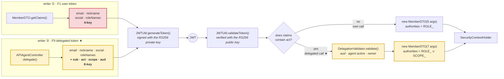
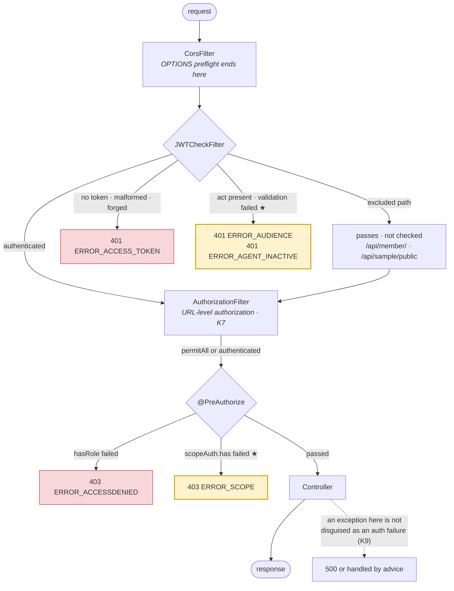

<br>

# agentic-auth

[한국어](README.md) · **English** · [中文](README.zh-CN.md)

> **When something calls an API on my behalf, whose authority does that request carry?**
>
> An integration, an automation tool, an AI agent — it is the same problem.
> What changed is that **AI agents made it urgent**: you cannot know in advance what they will call,
> and what the user delegates is **not access, but judgement.**
>
> This repository was built to answer that one question.
> It turns the answer into code, **makes the breakage visible by clicking through it in a browser**,
> and **enforces the procedure for changing that code through agent tool permissions and prompts.**

---

## ● Why this exists

The phrase "AI agent" currently means two entirely different things. This repository deals with **both**,
and reading them as one makes neither make sense — so let's separate them first.

### 1. Development-time agents — AI that writes the code

The Claude Code subagents defined in `.claude/agents/`.
A pipeline that allows auth code to be changed **only** in the order **spec → design → task order → implementation**.
None of it ships. There is no AI dependency in `build.gradle`.

### 2. Runtime agents — AI running inside the shipped product

AI embedded in the service your users actually use: chatbots, an AI that calls APIs on the user's behalf,
an agent attached to an MCP server. **This is part of the deployment, so it needs its own authentication.**
That is why "how do we issue JWT/OAuth to an AI agent" is a live question right now.

> **The goal of this repository is #2.** #1 is how #2 got built.
>
> Runtime agent authentication (`F9~F13`) was built, and it was implemented **exclusively through the
> development-time agent pipeline (#1)**. Every line of delegated-auth code here came through those four stages.

### So who is that "runtime agent"? — It is not in this repository

**This repository does not build an AI. It builds the seat an AI plugs into, and the authentication for that seat.**

|                     | Is it an agent? | What it actually is                                                        |
| ------------------- | --------------- | -------------------------------------------------------------------------- |
| `.claude/agents/`   | ✅              | Reasons, uses tools, produces output — **development-time**                |
| **Claude · Cursor** | ✅              | Attaches over MCP and picks tools itself — **runtime. This is what F9~F13 authenticates** |
| `mcp-server/`       | ❌              | A **tool surface**. No autonomy; it exposes four functions                 |
| `agent-example/`    | ❌              | A **script** that walks a fixed sequence                                    |
| `domain/Agent.java` | ❌              | A **delegation registration record** — closer to an OAuth client registration |

Hence the name `agentic-auth` — it is **"auth for agents"**, not "an agent".

### Why MCP is here

That the agent lives outside this repository is by design. What remains is **how that AI gets in.**
MCP is the channel — the standard through which AI clients like Claude and Cursor attach to external tools.

Without it, **no AI was actually using this authentication.** You could confirm from the frontend what a
delegated token blocks and what it allows, but that is **proof of the mechanism.**
Whether an AI actually operates within those constraints could not be checked.

With an MCP server, **Claude becomes the actual actor** — it picks tools itself, and when it is denied,
it reads the reason and explains it to the user.

```
user ──[password]──> mint-token ──[delegated token]──> MCP server ──> API
                                                            ↑
                                                 the AI only knows from here on
```

The MCP server **knows neither the user's password nor the user's token.** It holds one delegated token.
So it cannot go outside its `scope`, and when the user revokes it, **the very next call is blocked — with no restart.**
Both were verified by attaching a real MCP client → [`mcp-server/`](mcp-server/README.md)

---

## ● How this differs from `security-jwt-agents`

This repository forked from [`security-jwt-agents`](https://github.com/excelh11/security-jwt-agents).
That one aimed to **"see with your own eyes where Spring Security + JWT blocks a request"**, and the
4-stage pipeline was a means of changing that code safely.

**Here the goal changed.** User authentication (`F1~F8`) is now the **foundation**, and the real subject is
**delegated authentication for runtime agents (`F9~F13`)** built on top of it.

|                       | security-jwt-agents             | **agentic-auth**                                              |
| --------------------- | ------------------------------- | ------------------------------------------------------------- |
| Goal                  | Verify user auth visually       | **Build delegated agent authentication**                      |
| Functional spec       | `F1~F8`                         | `F1~F8` (foundation) + **`F9~F13`**                           |
| JWT signing           | HS256 symmetric (hardcoded)     | **RS256 asymmetric** — whoever can verify cannot forge        |
| What the token says   | "I am user1"                    | "**with user1's authority, scheduler-bot is** making this call" |
| Unit of authority     | Role (`ROLE_USER`)              | Role **+ action-level scope** (`sample:read`)                  |
| Revocation            | Impossible (no token revocation)| **Revoke one agent only** — the user is not logged out        |
| Auditing              | Scattered logs                  | **Delegator + actor recorded as a pair**                      |
| Known defects         | **K4·K6·K7 unresolved** of `K1~K9` | **All of `K1~K9` resolved** (K6 corrected as a misclassification) |
| Tests                 | 21                              | **54**                                                        |

---

## ● What the problem is

When `user1` logs in, this is still the token that goes out.

```json
{ "email": "user1@aaa.com", "roleNames": ["USER"], "exp": 1786… }
```

This token says exactly one thing — **"I am user1."**
A human was sitting in front of the browser, so that was enough.

**But the moment you tell an AI "check my calendar and book a meeting if nothing clashes", that premise breaks.**
The agent has to call `GET /api/schedule` and `POST /api/meeting` on your behalf, and no human pressed a button.
Whose authority should that request carry?

The easiest answer is to **hand over user1's token as-is**. It works. Four things collapse in exchange.

| #   | What collapses               | Why                                                                                            |
| --- | ---------------------------- | ---------------------------------------------------------------------------------------------- |
| 1   | **Actor is indistinguishable** | Every log line says `user1@aaa.com`. Nothing in the token says whether a human or a bot did it |
| 2   | **Over-delegation**          | You said "just read my calendar", but that token can do **everything** `ROLE_USER` can — payments, account deletion |
| 3   | **No individual revocation** | To cut the agent off you must invalidate user1's token, which **logs the user out too**        |
| 4   | **Blast radius**             | A **full-authority 24-hour token** sits on an external agent service                            |

## ● How it is solved

Think of a **valet key**. You do not hand over the master key when you leave your car at a hotel.
A valet key opens the door and starts the engine but not the trunk. And because it is a **different key**,
if the trunk was ever opened, "the valet key could not have done it" is provable.

A delegated token looks like this.

```json
{
  "sub": "user1@aaa.com",        // on whose behalf?  ← source of authority   F9
  "act": "agent-a46e2155-…",     // who is actually doing it? ← the actor     F9
  "scope": ["sample:read"],      // how far can it go?                        F10
  "aud": "agentic-auth-server",  // where is it valid?                        F11
  "exp": 1786068519              // 10 minutes
}
```

The key point is that `sub` (delegator) and `act` (actor) are **separated**.
A user's own login token has **none of these four** — their presence is itself the signal of "a delegated call".

|                        | What it does                                                          | Problem it blocks |
| ---------------------- | --------------------------------------------------------------------- | ----------------- |
| **F9** `act` claim     | Records the actor apart from the delegator · agent registration/revocation | 1, 3          |
| **F10** scope          | Enumerates what this token may do · **cannot exceed the delegator's authority** | 2        |
| **F11** `aud`          | Valid only at the designated API server                               | 4                 |
| **F12** asymmetric signing | Private key issues, public key verifies — **a verifier cannot forge** | —              |
| **F13** audit log      | Records `sub` + `act` as a pair                                       | 1                 |

> The standards already exist. `act` is **RFC 8693** (OAuth 2.0 Token Exchange); `sub`·`aud`·`exp` are **RFC 7519** (JWT).
> Nothing was invented here — those standards were laid onto this project's `MemberDTO.getClaims()` ↔ `JWTCheckFilter` pair.

### What makes AI agents different from a classic integration

The mechanism above **works with or without AI.** It applies just as well to an integration or an automation tool.
So why did AI agents make this urgent?

|                     | Classic integration (OAuth app) | AI agent                                            |
| ------------------- | ------------------------------- | --------------------------------------------------- |
| Which APIs it calls | **Declared up front**           | **Decided at runtime, by itself**                   |
| What is delegated   | Access                          | **Judgement** — what to do is handed over too       |
| Manipulation risk   | The code does not change        | **It is steered by what it reads** (prompt injection) |
| Count · lifetime    | Few · long-lived                | Many · short-lived                                  |

**"You cannot know in advance what it will call"** is the crux. If you could, you would not need delegation —
a service account with fixed permissions would do. Because you cannot, the scope must be narrow
and revocation must be immediate.

> Conversely, for automation whose steps are already fixed, the delegation machinery here may be **overkill.**
> A single service account is enough for a fixed script like `agent-example/agent.mjs`.

### So what gets better

- **A breach has a small radius.** A leaked delegated token can do only `sample:read`, for 10 minutes, at one server.
- **Accountability becomes answerable.** "Did the user make this payment, or which agent did?" now has an answer.
- **You can cut off one agent.** Block a single misbehaving bot and the user stays logged in.
- **The user keeps control.** You can build a consent screen like "allow this agent read access only." Until now it was all or nothing.

|              |                                                                |
| ------------ | -------------------------------------------------------------- |
| **Frontend** | React 19 · TypeScript · Vite 8                                 |
| **Backend**  | Java 21 · Spring Boot 3.5.15 · Spring Security 6 · jjwt 0.11.5 |
| **Data**     | Spring Data JPA · MariaDB                                      |
| **Agents**   | 4 Claude Code subagents + a slash command                      |

> Building F9~F13 added **zero gradle dependencies.** jjwt 0.11.5 already supports RS256.

---

## ● Result Image

Everything from login through delegated-token issuance, scope violations and agent revocation sits behind
one button each. Every request's **HTTP status code and raw response body** stacks up in the log panel.


### F1~F8 · User authentication (the foundation)

| #   | Action                                 | Expected result                                                |
| --- | -------------------------------------- | -------------------------------------------------------------- |
| 1   | Log in                                 | 200 · accessToken · refreshToken issued, payload and time left  |
| 2   | Log in with the wrong password         | **401** `ERROR_LOGIN`                                          |
| 3   | Call a protected API (with token)      | 200                                                            |
| 4   | Call a protected API (no token)        | **401** `ERROR_ACCESS_TOKEN`                                   |
| 5   | Call with a forged token               | **401** `ERROR_ACCESS_TOKEN`                                   |
| 6   | Call the ADMIN-only API                | **403** `ERROR_ACCESSDENIED` for a USER account                |
| 7   | Call refresh (token still valid)       | The same token pair returned unchanged                          |
| 8   | Force accessToken expiry → call API    | **401** `ERROR_ACCESS_TOKEN`                                   |
| 9   | Then call refresh                      | A new accessToken is issued                                     |
| 10  | Call refresh without refreshToken      | **400** (missing parameter) ※                                   |

### F9~F13 · Agent delegated authentication

| #   | Action                                     | Expected result                                                |
| --- | ------------------------------------------ | -------------------------------------------------------------- |
| 1   | Register an agent                          | `agentId` issued                                               |
| 2   | Issue a delegated token (`sample:read` only) | A token carrying `sub`·`act`·`scope`·`aud`                    |
| 3   | Show the delegated token payload           | The four claims a user token never has                          |
| 4   | An API inside scope (`/api/sample/user`)   | **200**                                                        |
| 5   | An API outside scope (`/api/sample/list`)  | **403** `ERROR_SCOPE`                                          |
| 6   | Call with a tampered audience              | **401** `ERROR_ACCESS_TOKEN` ※※                                |
| 7   | Try to delegate beyond your own authority  | `ERROR_SCOPE_EXCEEDS_ROLE`                                     |
| 8   | Try to re-delegate using a delegated token | Denied `ERROR_SCOPE`                                           |
| 9   | Revoke the agent (deactivate)              | 200 · **the user's own token stays alive**                     |
| 10  | Call with the delegated token after revocation | **401** `ERROR_AGENT_INACTIVE` — blocked even before expiry |

> **Look at the difference between 4 and 5.** Same delegated token: one passes, one is blocked.
> **With the user's own token, both return 200.** Scope is an additional constraint that applies only to delegation;
> it does not replace the user's role-based authority.
>
> **Right after 9, look at "current token state" at the top of the screen.** Only the agent was cut off; the user is fine.
> That is problem #3 (no individual revocation) solved.
>
> **Why F2 (statelessness) has no button** — it is the property that the server does **not** create a session,
> so there is nothing to click. The whole screen is the evidence instead: no cookies, no session,
> every call made with nothing but the token in `localStorage`.

> ※ F5 in `docs/1-SPEC.md` says `NULL_REFRASH` comes back here, but it is actually a 400.
> `@RequestParam` is required by default, so Spring blocks the call before the method is entered.
> The `null` check inside the controller is **unreachable code**.
>
> ※※ Why 6 is **not** `ERROR_AUDIENCE` — the browser has no signing key, so changing `aud` breaks the signature.
> The server verifies the signature **before** it verifies audience, so `ERROR_ACCESS_TOKEN` comes out first.
> **That is not a defect; it is proof that F12 (asymmetric signing) works.**

The frontend branches on the **`error` string in the body**, not the status code. A single 401 carries
`ERROR_LOGIN` · `ERROR_ACCESS_TOKEN` · `ERROR_AGENT_INACTIVE` · `ERROR_AUDIENCE` alike.

---

## ● Layout

```
agentic-auth/         # ← repository root · run Claude Code here
├── .claude/agents/   # the 4-stage pipeline agents
├── .claude/commands/ # the /agentic slash command
├── SKILL.md          # definition for reusing this project as a skill
├── docs/             # the reference documents the agents reason from
├── server/           # Backend — Spring Boot (:8080), the Gradle project root
│   ├── keys/         #   RS256 key pair (F12) — gitignored, auto-generated if absent
│   └── src/main/java/com/agenticauth/
├── front/            # Frontend — Vite + React + TS (:5173), verification only
├── agent-example/    # An agent script that uses a delegated token (Node, zero deps)
└── mcp-server/       # MCP server — Claude · Cursor call this API directly
```

The frontend and backend are **deliberately kept apart.** Only with different origins do CORS and preflight
actually travel over the wire, and only then can you confirm the auth really works. That is why no Vite proxy is used.

---

## ● Running it

You need two terminals, and MariaDB must already be up.

```bash
# 0) Prepare the DB (once) — run server/db/schema.sql in MariaDB
#    This creates the agenticauthdb database and the aauthuser account

# 1) Create the test accounts (once)
cd server
./gradlew.bat test --tests "com.agenticauth.repository.MemberRepositoryTests"

# 2) Backend — http://localhost:8080
./gradlew.bat bootRun

# 3) Frontend (another terminal, from the repository root) — http://localhost:5173
cd front
npm install
npm run dev
```

Test account `user1@aaa.com` / `1111` — it **must be stored BCrypt-hashed** in the DB. Plain text always yields `ERROR_LOGIN`.

```bash
cd server
./gradlew.bat test        # 54 tests
```

### Seeing it from the agent's side

The frontend screen is where a human clicks through the **delegation mechanism** to confirm it.
**The client side — holding nothing but a delegated token** — is a separate thing.

```bash
cd agent-example
node agent.mjs            # zero dependencies — Node 18+ built-in fetch
```

It prints `[user]` and `[agent]` separately, so you can watch in the terminal that
**the same API is blocked for the agent and allowed for the user**, and that
**cutting off the agent does not log the user out.**
It exits with code 1 if anything differs from expectations, so it drops straight into CI.
See [`agent-example/README.md`](agent-example/README.md).

### Attaching a real AI — the MCP server

Where the script proves the flow, [`mcp-server/`](mcp-server/README.md) **makes a real AI the actor.**
Attach Claude Code, Claude Desktop or Cursor and that AI calls this API on the user's behalf.

```bash
cd mcp-server
npm install
node mint-token.mjs --scope sample:read    # the user delegates → a ready-to-paste config is printed
node test-client.mjs                       # verified by attaching a real MCP client
```

```
user ──[password]──> mint-token.mjs ──[delegated token]──> MCP server ──> API
                                                                ↑
                                                     the AI only knows from here on
```

Ask the AI _"fetch the list"_ without having delegated `sample:list`, and
**the AI is denied and explains that to the user.** Revoke the agent and
**the very next call is blocked without restarting the MCP server.**

> **Do not delete `server/keys/`.** It holds the RS256 key pair; if it is missing a new one is generated and
> **every token issued before that becomes invalid.** It is gitignored, so it is created automatically on first boot after cloning.

---

## ● Agents

Auth code breaks quietly when you change one place wrongly, because it contains couplings
**the compiler cannot check** — such as the side that writes `claims` and the side that reads them.
So the code is not edited directly; it goes through four stages.

```
SPEC  ──→  PLAN  ──→  TASKS  ──→  IMPLEMENT
what?      how?       in what order?   write the code
```

### The agents, stage by stage

| Stage         | Agent           | Tool permissions                    | Where it may write        | Output                              |
| ------------- | --------------- | ----------------------------------- | ------------------------- | ----------------------------------- |
| 1 · SPEC      | `agentic-spec`  | `Read` `Write` `Edit` `Glob` `Grep` | **`docs/1-SPEC.md` only** | Requirements, contract-impact analysis |
| 2 · PLAN      | `agentic-plan`  | `Read` `Glob` `Grep` `Bash` (queries) | **Nowhere — read-only** | Technology choices, design decisions, risks |
| 3 · TASKS     | `agentic-tasks` | `Read` `Write` `Edit` `Glob` `Grep` | **`docs/` only**          | Tasks split in dependency order     |
| 4 · IMPLEMENT | `agentic-impl`  | + `Bash`                            | **Everywhere**            | Code + tests + verification results |

### What is enforced, and what is not

`.claude/agents/agentic-spec.md` is **not an agent — it is a definition.**
It is six lines of frontmatter wrapped in `---`, followed by a system prompt.

```yaml
---
name: agentic-spec
description: "…"                       # when to call this agent
tools: Read, Write, Edit, Glob, Grep    # ★ the only line the harness actually enforces
model: sonnet
---
```

**A tool absent from `tools:` cannot be used no matter what the prompt says.** That is what makes this one line special.
Everything else is prompt — expected to be followed, not structurally prevented.

|                                                            | What blocks it                              | Can it be bypassed?          |
| ---------------------------------------------------------- | ------------------------------------------- | ---------------------------- |
| `agentic-plan` cannot modify files                          | **`Write`·`Edit` are absent from `tools:`**  | ❌ Impossible                |
| `agentic-spec`·`agentic-tasks` do not touch **code**        | Prompt instruction                          | ⚠️ Possible — relies on discipline |
| `agentic-plan`'s `Bash` being query-only                    | Prompt instruction                          | ⚠️ Possible                  |

> **Originally stages 1–3 had no write tools at all.** In practice, though, SPEC and TASKS
> **could not even write their own output documents under `docs/`**, so a human had to transcribe them every time.
> So those two were given `Write`·`Edit`, and **the scope restriction dropped to the prompt level.**
> **The enforcement genuinely weakened** — but `agentic-plan` stays read-only, so
> "the design stage cannot touch files" still holds structurally for one stage.

### What this pipeline actually caught

Every part of F9~F13 came through these four stages, and **the design stages found real holes before any code was written.**

- **PLAN** — `/api/member/` paths are excluded from `JWTCheckFilter`, so a revoked agent could
  **come back to life through refresh**. Caught before implementation; blocked by adding a separate check in
  `APIRefreshController`, with a dedicated task to prove it.
- **PLAN** — exposing a `Filter` type as a Spring Bean makes the servlet container **register it twice**,
  running it twice per request (and duplicating the audit log). Worked around with `new` assembly instead of Bean promotion.
- **TASKS** — flagged `MemberDTO` · `JWTCheckFilter` · `CustomSecurityConfig` and the tests as
  **one atomic unit that will not even compile if split**, so the work could not stop halfway.
- **IMPLEMENT** — put a gate immediately after `@PreAuthorize` was first added to `SampleController`:
  **"does a plain user token still get 200?"** — with no progress allowed until it passed.

### Why do it this way

This is not a newly invented procedure. **Writing a design document, agreeing on it, then writing code** is a
long-standing standard practice; all that happens here is that each stage is enforced by
**agent tool permissions and prompts** rather than human discipline.
(For what is blocked by tools versus prompt, see [What is enforced, and what is not](#what-is-enforced-and-what-is-not) above.)
In LLM coding tools the same direction is settling under the name _spec-driven development_ —
AWS Kiro and GitHub Spec Kit are solving the same problem.

Two reasons it pays off especially for auth code:

- **There are couplings the compiler cannot catch.** The side that writes `claims` (`MemberDTO.getClaims()`) and
  the side that reads them (`JWTCheckFilter`) are joined only by string keys. Change one and the build still passes —
  it blows up at runtime.
- **The error strings are the API contract.** Change one `ERROR_ACCESS_TOKEN` and the frontend's branching quietly breaks.
  The SPEC stage judges contract impact first and stops there if anything would break.

### How to use it

```
/agentic let users choose the expiry time on delegated tokens
/agentic add a per-agent call-rate limit
```

Each stage shows its result and **waits for approval** before moving on. The four stages are never run in one go.
You can also call a stage directly — _"use the agentic-spec agent to pin down the requirements first"_.

### Rules the agents follow

- **Do not guess.** Read the actual files and describe current behaviour with `file:line` evidence.
- **Error strings and response field names are a contract with the frontend.** Changes require user approval; additions are free.
- **Known defects may only be proposed.** Never fixed, and never widened in scope, without approval.
- **Do not hide failures.** If a test broke, paste the raw output. If `@SpringBootTest` could not run for lack of a DB,
  do not say it "passed".

### Reference documents

The agents judge only from these documents. **When the spec changes, the document is fixed before the code.**

| Document                             | Contents                                                       |
| ------------------------------------ | -------------------------------------------------------------- |
| [`docs/0-RULES.md`](docs/0-RULES.md) | **Working rules** — things that actually went wrong here, with evidence |
| [`docs/1-SPEC.md`](docs/1-SPEC.md)   | Functional spec `F1~F13`, the error-code contract, known defects `K1~K9` |
| [`docs/2-PLAN.md`](docs/2-PLAN.md)   | Available technologies, forbidden APIs, request-processing flow |
| [`docs/3-TEST.md`](docs/3-TEST.md)   | Test-code templates, a 39-item regression checklist            |

### Taking it to another project

These agents are **not for generating a project from an empty folder**, because `agentic-spec` operates on the premise
_"do not guess; read the actual files and confirm current behaviour before describing it."_
Instead, **start from this repository** — code, specs and rules travel as one set — and grow from there.

**1. Get the repository**

```bash
git clone https://github.com/excelh11/agentic-auth.git my-auth
cd my-auth
```

**2. Change the package name** — `com.agenticauth` to whatever you want. Three places must change together.

```
server/src/main/java/com/agenticauth/     directory name
server/src/test/java/com/agenticauth/     directory name
package · import declarations in *.java
path references in docs/*.md · CLAUDE.md
```

**3. Fill in the DB settings**

```bash
cd server/src/main/resources
cp application.properties.example application.properties   # fill in the values
```

**4. Start by editing `docs/1-SPEC.md`.** The spec comes before the code.
Delete what you do not need and write down what you do. The agents judge from this document.

**5. Add features with `/agentic`**

```
/agentic make tokens issued via social login go through the same filter
```

> ⚠️ **The agent definitions live in `.claude/` at the repository root.**
> You have to run Claude Code **from the repository root** for `/agentic` and the subagents to be picked up.
> Starting it inside `server/` will not work.

---

## ● Class diagrams

All five diagrams live in **[`docs/diagrams/class-diagrams.md`](docs/diagrams/class-diagrams.md)**.
Only the two you need to understand this project are reproduced here.

> They used to be PNGs, but every class change meant redrawing them, so they became **Mermaid text.**
> Now a code change shows up in the diagram's diff too.

### The side that writes claims and the side that reads them — the most dangerous point

`MemberDTO` flattens its own fields into a `Map` and loads it into the token;
`JWTCheckFilter` pulls the keys back out one at a time and reassembles it.
**They are joined only by strings, so changing one side compiles fine and blows up at runtime.**

In F9~F13 **the writing side split in two.** There is still one reading side, and it branches on the presence of `act`.



> **The two red boxes are a pair.** Add a key or rename one here and the reading side in `JWTCheckFilter`
> **must** change with it. The compiler will tell you nothing.

### The path a single request takes

Which gate blocks it, and with which code. **The gates F9~F13 added are yellow.**



> **The trap was that `/api/member/` paths are excluded from the filter.**
> `APIRefreshController` never goes through `JWTCheckFilter`, so **it has to validate delegation itself.**
> Otherwise a revoked agent comes back to life through refresh.

---

## ● Known defects in the backend code

Defects are not hidden — all of them are recorded as `K1~K9` in `docs/1-SPEC.md`. The agents
**cannot fix these without approval**; the point is to leave a record of what was known and deliberately left alone.

**Nothing is currently unresolved.** All of it was fixed through this pipeline.

| #      | What it was                                                                                    | What was done                                                                            |
| ------ | ---------------------------------------------------------------------------------------------- | ---------------------------------------------------------------------------------------- |
| **K1** | A `null` header caused an NPE at `substring(7)` → the catch swallowed it and distorted the cause | Check the `Bearer ` prefix before parsing and record the cause with `log.warn`             |
| **K2** | Auth failures went out as HTTP 200 with no `setStatus()`                                        | `JWTCheckFilter` · `APILoginFailHandler` both **401**                                     |
| **K3** | `ResponseEntity.ok()` — JWT exceptions returned 200 too                                         | `ResponseEntity.status(UNAUTHORIZED)` — **401**                                           |
| **K4** | The JWT signing key was a hardcoded **symmetric** key — a verifier could forge                  | **Resolved by F12.** Switched to an RS256 key pair, loaded from `server/keys/` or generated |
| **K5** | `pw` (a BCrypt hash) rode along in the JWT claims and was readable from the payload             | Removed from claims · `null` in credentials — this came with an **F1 response-contract change** |
| **K7** | `authorizeHttpRequests` was unset — protection relied entirely on `@PreAuthorize`               | Added URL-level authorization as a **floor** so an endpoint missing the annotation is not left open |
| **K8** | Only `"Expired"` counted as expiry, so **a broken token was handed straight back with a 200**   | Every validation failure now triggers reissue. Reissue happens only after `refreshToken` is verified |
| **K9** | `filterChain.doFilter()` sat inside `try`, so **even controller/DB exceptions became `ERROR_ACCESS_TOKEN` 401** | Moved the chain call outside `try`. Authentication ends there; later exceptions are left untouched |

> **K8 was fixed differently here than in security-jwt-agents** — that repository **rejects with a 401** any token
> invalid for a reason other than expiry. Here, following the OAuth2 `refresh_token` grant reading in which the
> `refreshToken` *is* the credential, such a token simply **triggers reissue**; the accessToken is only a hint
> answering "do I need a new one?". Both stop the actual K8 defect — handing a broken token back with a 200.
> **Neither is a bug.**

**⚪ Corrected — K6**

> It was recorded as "uses deprecated jjwt 0.11.5 APIs", but **it was not a defect.**
> Compiling with `-Xlint:deprecation` produced **zero deprecation warnings.**
> `setClaims`·`parserBuilder`·`setExpiration` are **the official APIs in 0.11.5** and become deprecated in 0.12.x —
> so an **upgrade-time item** had been mis-recorded as a current defect.
> The **one real warning** it surfaced (an unchecked cast) was cleaned up; compile warnings are now **zero**.

K5 **changed the response contract**, so F1 in `docs/1-SPEC.md` was fixed first, then
`MemberDTO.getClaims()` (writer) and `JWTCheckFilter` (reader) in one go, and the frontend's `types.ts` as a pair.
To prevent regression, **a test that decodes the issued token's payload and asserts no hash is present** was added.

The DB credentials in `application.properties` are **for local development** and are not committed.

---

## ● License

[MIT](LICENSE)
