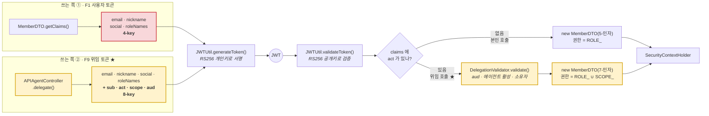
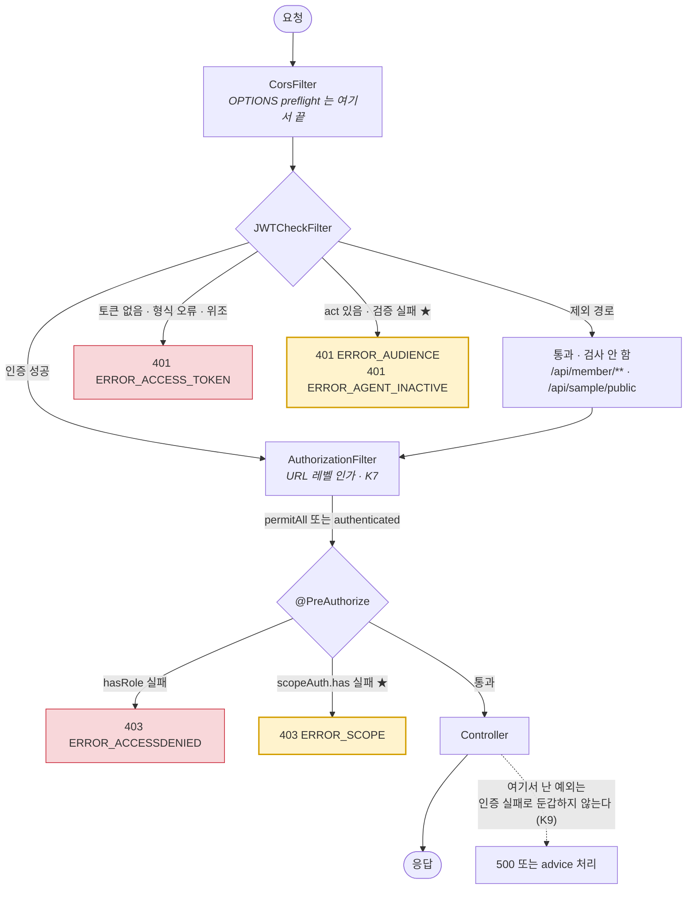

<br>

# agentic-auth

**한국어** · [English](README.en.md) · [中文](README.zh-CN.md)

> **누군가 나를 대신해 API를 호출할 때, 그 요청은 누구의 자격으로 나가야 하나?**
>
> 연동 서비스든 자동화 도구든 AI 에이전트든 같은 문제다.
> 다만 **AI 에이전트에서 이 문제가 지금 절박해졌다** — 무엇을 호출할지 미리 알 수 없고,
> 사용자가 위임하는 것이 **접근 권한이 아니라 판단**이기 때문이다.
>
> 이 저장소는 그 질문 하나에 답하려고 만들었다.
> 답을 코드로 만들고, **브라우저에서 눌러서 깨지는 걸 눈으로 보게** 하고,
> 그 코드를 고치는 절차를 **에이전트의 도구 권한과 프롬프트로 강제**한다.

---

## ● 왜 만들었나

"AI 에이전트"라는 말은 요즘 두 가지 전혀 다른 것을 가리킨다. 이 저장소는 **둘 다** 다루는데,
섞어서 읽으면 아무것도 이해가 안 되므로 먼저 갈라놓는다.

### 1. 개발 시점 에이전트 — 코드를 만드는 AI

`.claude/agents/` 에 정의된 Claude Code 서브 에이전트들이다.
**명세 → 설계 → 작업 순서 → 구현** 네 단계로만 인증 코드를 고칠 수 있게 만든 파이프라인이고,
배포물에는 들어가지 않는다. `build.gradle` 에 AI 의존성이 없다.

### 2. 런타임 에이전트 — 배포된 제품 안에서 도는 AI

사용자가 쓰는 서비스에 AI가 들어가 있는 경우다. 챗봇, 사용자 대신 API를 호출하는 AI,
MCP 서버에 붙는 에이전트 같은 것. **이건 배포물의 일부라서 자기 인증이 필요하다.**
그래서 요즘 "AI 에이전트에게 JWT/OAuth를 어떻게 발급할 것인가"가 실제로 뜨거운 주제다.

> **이 저장소의 목표는 2번이다.** 1번은 2번을 만드는 방법이다.
>
> 런타임 에이전트의 인증(`F9~F13`)을 만들고, 그것을 **개발 시점 에이전트 파이프라인(1번)으로만**
> 구현했다. 실제로 이 저장소의 위임 인증 코드는 전부 그 4단계를 거쳐 들어왔다.

### 그 "런타임 에이전트"는 누구인가 — 이 저장소 안에는 없다

**이 저장소는 AI를 만들지 않는다. AI가 붙을 자리와, 그 자리의 인증을 만든다.**

|                     | 에이전트인가 | 실제로 무엇인가                                                               |
| ------------------- | ------------ | ----------------------------------------------------------------------------- |
| `.claude/agents/`   | ✅           | 판단하고 도구를 쓰고 결과를 낸다 — **개발 시점**                              |
| **Claude · Cursor** | ✅           | MCP로 붙어 스스로 도구를 고른다 — **런타임. 이게 F9~F13이 인증하는 대상이다** |

그래서 이름이 `agentic-auth` 다 — **"auth for agents"** 다.

### MCP가 왜 들어갔나

에이전트가 저장소 밖에 있는 것은 설계다. 그러면 **그 AI가 어떻게 들어오는가**가 남는다.
MCP가 그 통로다 — Claude·Cursor 같은 AI 클라이언트가 외부 도구에 붙는 표준 규격이다.

이게 없을 때는 **이 인증을 실제로 쓰는 AI가 없었다.** 위임 토큰이 무엇을 막고 무엇을 열어주는지는
프론트 화면에서 확인할 수 있었지만, 그건 **메커니즘의 증명**이다.
**AI가 그 제약 안에서 실제로 움직이는지**는 확인할 방법이 없었다.

MCP 서버를 두면 **Claude가 진짜 행위자가 된다** — 스스로 도구를 고르고,
거부당하면 그 이유를 읽고 사용자에게 설명한다.

```
사용자 ──[비밀번호]──> mint-token ──[위임 토큰]──> MCP 서버 ──> API
                                                      ↑
                                                AI는 여기부터만 안다
```

MCP 서버는 **사용자 비밀번호도 사용자 토큰도 모른다.** 위임 토큰 하나만 들고 있다.
그래서 `scope` 밖은 못 하고, 사용자가 회수하면 **재시작 없이 다음 호출부터** 막힌다.
이 두 가지를 실제 MCP 클라이언트로 붙어서 확인했다 → [`mcp-server/`](mcp-server/README.md)

---

## ● `security-jwt-agents` 와 무엇이 다른가

이 저장소는 [`security-jwt-agents`](https://github.com/excelh11/security-jwt-agents) 에서 갈라져 나왔다.
그 저장소는 **"Spring Security + JWT가 어디서 막히는지 눈으로 본다"** 가 목적이었고,
4단계 파이프라인은 그 코드를 안전하게 고치기 위한 수단이었다.

**여기서는 목적이 바뀌었다.** 사용자 인증(`F1~F8`)은 이제 **토대**이고,
그 위에 **런타임 에이전트의 위임 인증(`F9~F13`)** 을 올리는 것이 본론이다.

|                  | security-jwt-agents       | **agentic-auth**                                          |
| ---------------- | ------------------------- | --------------------------------------------------------- |
| 목적             | 사용자 인증을 눈으로 검증 | **에이전트 위임 인증을 만든다**                           |
| 기능 명세        | `F1~F8`                   | `F1~F8`(토대) + **`F9~F13`**                              |
| JWT 서명         | HS256 대칭키 (하드코딩)   | **RS256 비대칭** — 검증만 하는 쪽은 위조 못 한다          |
| 토큰이 말하는 것 | "나는 user1이다"          | "**user1의 권한으로, scheduler-bot이** 실행하는 요청이다" |
| 권한 단위        | 역할 (`ROLE_USER`)        | 역할 **+ 동작 단위 scope** (`sample:read`)                |
| 회수             | 불가 (토큰 폐기 없음)     | **에이전트만 개별 회수** — 사용자는 로그아웃되지 않는다   |
| 감사             | 산발적 로그               | **위임자 + 행위자를 짝으로** 기록                         |
| 알려진 결함      | `K1~K9` 중 **K4·K7 미해결** | **`K1~K9` 전부 해결** (K6은 오분류로 정정)                  |
| 테스트           | 20개                      | **54개**                                                  |

---

## ● 무엇이 문제인가

`user1` 이 로그인하면 지금도 이런 토큰이 나간다.

```json
{ "email": "user1@aaa.com", "roleNames": ["USER"], "exp": 1786… }
```

이 토큰이 말하는 건 하나뿐이다 — **"나는 user1이다."**
브라우저 앞에 사람이 앉아 있으니 그걸로 충분했다.

**그런데 "내 일정 확인해서 안 겹치면 회의 잡아줘" 를 AI에게 시키는 순간 전제가 깨진다.**
에이전트가 대신 `GET /api/schedule`, `POST /api/meeting` 을 호출해야 하는데,
사람이 누른 게 아니다. 이 요청은 누구 자격으로 나가야 하나?

가장 쉬운 답은 **user1의 토큰을 그대로 넘기는 것**이다. 동작은 한다. 대신 네 가지가 무너진다.

| #   | 무너지는 것          | 왜                                                                                                  |
| --- | -------------------- | --------------------------------------------------------------------------------------------------- |
| 1   | **행위자 구분 불가** | 로그에 전부 `user1@aaa.com`. 사람이 한 건지 봇이 한 건지 토큰 안에 그 정보가 없다                   |
| 2   | **권한 과다 위임**   | "일정만 봐줘"라고 시켰는데 그 토큰은 `ROLE_USER`가 할 수 있는 **전부**를 할 수 있다. 결제도, 탈퇴도 |
| 3   | **개별 회수 불가**   | 에이전트를 끊으려면 user1의 토큰을 무효화해야 하고, 그러면 **사용자 본인도 로그아웃**된다           |
| 4   | **유출 반경 과대**   | 외부 에이전트 서비스에 **풀 권한 24시간 토큰**이 그대로 남는다                                      |

## ● 어떻게 푸는가

**발레 파킹 키**를 생각하면 된다. 호텔에 차를 맡길 때 마스터 키를 통째로 주지 않는다.
발레 키는 문 열기와 시동만 되고 트렁크는 안 열린다. 게다가 **다른 키**라서,
나중에 트렁크가 열렸으면 "발레 키로는 불가능했다"는 게 증명된다.

위임 토큰은 이렇게 생겼다.

```json
{
  "sub": "user1@aaa.com", // 누구를 위해서?   ← 권한의 출처      F9
  "act": "agent-a46e2155-…", // 누가 실제로 하나? ← 행위자          F9
  "scope": ["sample:read"], // 뭐까지 되나?                       F10
  "aud": "agentic-auth-server", // 어디서만 되나?                     F11
  "exp": 1786068519 // 10분
}
```

핵심은 `sub`(위임자)와 `act`(행위자)가 **분리**됐다는 것이다.
사용자 본인 로그인 토큰에는 이 넷이 **없다** — 있다는 것 자체가 "위임된 호출"이라는 뜻이다.

|                     | 하는 일                                                         | 막는 문제 |
| ------------------- | --------------------------------------------------------------- | --------- |
| **F9** `act` 클레임 | 행위자를 위임자와 따로 기록 · 에이전트 등록/회수                | 1, 3      |
| **F10** scope       | 이 토큰으로 가능한 동작을 열거 · **위임자 권한을 넘을 수 없다** | 2         |
| **F11** `aud`       | 지정한 API 서버에서만 통함                                      | 4         |
| **F12** 비대칭 서명 | 발급은 개인키, 검증은 공개키 — **검증자가 위조할 수 없다**      | —         |
| **F13** 감사 로그   | `sub` + `act` 를 짝으로 기록                                    | 1         |

> 표준이 이미 있다. `act` 는 **RFC 8693**(OAuth 2.0 Token Exchange), `sub`·`aud`·`exp` 는 **RFC 7519**(JWT).
> 새로 발명한 게 아니라, 그 표준을 이 프로젝트의 `MemberDTO.getClaims()` ↔ `JWTCheckFilter` 짝에 얹었다.

### AI 에이전트는 기존 연동과 무엇이 다른가

위 메커니즘은 **AI와 무관하게 동작한다.** 연동 서비스에도, 자동화 도구에도 그대로 쓸 수 있다.
그런데도 AI 에이전트가 이 주제를 지금 절박하게 만든 이유가 있다.

|                | 기존 연동 (OAuth 앱)     | AI 에이전트                                  |
| -------------- | ------------------------ | -------------------------------------------- |
| 호출할 API     | **미리 선언**한다        | **런타임에 스스로 정한다**                   |
| 위임하는 것    | 접근 권한                | **판단** — 무엇을 할지까지 맡긴다            |
| 조작 위험      | 코드는 변하지 않는다     | **읽은 내용에 조종당한다** (프롬프트 인젝션) |
| 개수·수명      | 소수 · 장기              | 다수 · 단기                                  |

**"무엇을 부를지 미리 알 수 없다"** 가 핵심이다. 알 수 있다면 위임이 필요 없다 —
전용 계정에 고정 권한을 주면 끝이다. 알 수 없기 때문에 **범위를 좁히고, 언제든 회수할 수 있어야** 한다.

> 반대로 말하면, 할 일이 정해진 자동화라면 이 저장소의 위임 기능은 **과할 수 있다.**
> `agent-example/agent.mjs` 같은 고정 스크립트에는 서비스 계정 하나면 충분하다.

### 그래서 무엇이 좋아지나

- **사고가 나도 반경이 좁다.** 위임 토큰이 유출돼도 할 수 있는 건 `sample:read` 뿐이고, 10분간, 지정된 서버에서만.
- **책임 추적이 된다.** "이 결제는 본인이 했나, 어느 에이전트가 했나"에 답할 수 있다.
- **에이전트별로 끊을 수 있다.** 오작동하는 봇 하나만 차단해도 사용자는 로그인 상태 그대로다.
- **사용자가 통제권을 갖는다.** "이 에이전트에게 읽기만 허용" 같은 동의를 만들 수 있다. 지금까지는 전부 아니면 전무였다.

|                |                                                                |
| -------------- | -------------------------------------------------------------- |
| **프론트엔드** | React 19 · TypeScript · Vite 8                                 |
| **백엔드**     | Java 21 · Spring Boot 3.5.15 · Spring Security 6 · jjwt 0.11.5 |
| **데이터**     | Spring Data JPA · MariaDB                                      |
| **에이전트**   | Claude Code 서브 에이전트 4개 + 슬래시 커맨드                  |

> F9~F13을 만들면서 **gradle 의존성은 하나도 늘지 않았다.** jjwt 0.11.5가 이미 RS256을 지원한다.

---

## ● Result Image

로그인부터 위임 토큰 발급·scope 위반·에이전트 회수까지 전부 버튼 하나씩으로 확인한다.
모든 요청의 **HTTP 상태코드와 응답 본문 원문**이 로그 영역에 그대로 쌓인다.


### F1~F8 · 사용자 인증 (토대)

| #   | 동작                             | 기대 결과                                                       |
| --- | -------------------------------- | --------------------------------------------------------------- |
| 1   | 로그인                           | 200 · accessToken · refreshToken 발급, payload와 남은 시간 표시 |
| 2   | 틀린 비밀번호로 로그인           | **401** `ERROR_LOGIN`                                           |
| 3   | 보호 API 호출 (토큰 O)           | 200                                                             |
| 4   | 보호 API 호출 (토큰 X)           | **401** `ERROR_ACCESS_TOKEN`                                    |
| 5   | 위조 토큰으로 호출               | **401** `ERROR_ACCESS_TOKEN`                                    |
| 6   | ADMIN 전용 API 호출              | USER 계정이면 **403** `ERROR_ACCESSDENIED`                      |
| 7   | refresh 호출 (토큰 유효)         | 기존 토큰 쌍 그대로 반환                                        |
| 8   | accessToken 강제 만료 → API 호출 | **401** `ERROR_ACCESS_TOKEN`                                    |
| 9   | 이어서 refresh 호출              | 새 accessToken 발급                                             |
| 10  | refreshToken 없이 refresh        | **400** (파라미터 누락) ※                                       |

### F9~F13 · 에이전트 위임 인증

| #   | 동작                                | 기대 결과                                             |
| --- | ----------------------------------- | ----------------------------------------------------- |
| 1   | 에이전트 등록                       | `agentId` 발급                                        |
| 2   | 위임 토큰 발급 (`sample:read` 만)   | `sub`·`act`·`scope`·`aud` 가 실린 토큰                |
| 3   | 위임 토큰 payload 보기              | 사용자 토큰에는 없던 네 클레임이 보인다               |
| 4   | scope 안의 API (`/api/sample/user`) | **200**                                               |
| 5   | scope 밖의 API (`/api/sample/list`) | **403** `ERROR_SCOPE`                                 |
| 6   | audience 조작 호출                  | **401** `ERROR_ACCESS_TOKEN` ※※                       |
| 7   | 권한을 넘어서는 위임 시도           | `ERROR_SCOPE_EXCEEDS_ROLE`                            |
| 8   | 위임 토큰으로 재위임 시도           | 거부 `ERROR_SCOPE`                                    |
| 9   | 에이전트 회수(비활성화)             | 200 · **사용자 본인 토큰은 그대로 살아 있다**         |
| 10  | 회수 후 위임 토큰으로 호출          | **401** `ERROR_AGENT_INACTIVE` — 만료 전인데도 막힌다 |

> **4번과 5번의 차이를 보라.** 같은 위임 토큰인데 하나는 통과하고 하나는 막힌다.
> **사용자 본인 토큰으로는 둘 다 200이다.** scope 는 위임에만 걸리는 추가 제약이지,
> 사용자의 역할 권한 체계를 대체하지 않는다.
>
> **9번 직후 화면 위쪽 "현재 토큰 상태"를 보라.** 에이전트만 끊었는데 사용자는 멀쩡하다.
> 이게 문제 3번(개별 회수 불가)이 해결된 모습이다.
>
> **F2(세션리스)에 버튼이 없는 이유** — "서버가 세션을 만들지 **않는다**"는 성질이라
> 눌러서 확인할 대상이 없다. 대신 화면 전체가 F2의 증거다. 쿠키도 세션도 쓰지 않고
> `localStorage` 의 토큰만으로 모든 호출이 이뤄진다.

> ※ `docs/1-SPEC.md`의 F5는 `NULL_REFRASH`가 나온다고 적고 있지만 실제로는 400이다.
> `@RequestParam`이 필수라 메서드 진입 전에 Spring이 막기 때문이다. 컨트롤러 안의 `null` 검사는 **도달하지 않는 코드**다.
>
> ※※ 6번이 `ERROR_AUDIENCE`가 **아닌** 이유 — 브라우저에는 서명용 개인키가 없어 `aud`를 바꾸면 서명이 깨진다.
> 서버는 서명 검증을 audience 검증보다 **먼저** 하므로 `ERROR_ACCESS_TOKEN`이 먼저 나간다.
> **이건 결함이 아니라 F12(비대칭 서명)가 동작한다는 증거다.**

프론트는 상태코드가 아니라 **본문의 `error` 문자열로 분기한다.** 401 하나에
`ERROR_LOGIN` · `ERROR_ACCESS_TOKEN` · `ERROR_AGENT_INACTIVE` · `ERROR_AUDIENCE` 가 모두 들어오기 때문이다.

---

## ● 구성

```
agentic-auth/         # ← 저장소 루트 · Claude Code 실행 위치
├── .claude/agents/   # 4단계 파이프라인 에이전트
├── .claude/commands/ # /agentic 슬래시 커맨드
├── SKILL.md          # 이 프로젝트를 스킬로 가져다 쓰기 위한 정의
├── docs/             # 에이전트가 근거로 삼는 기준 문서 3종
├── server/           # 백엔드 — Spring Boot (:8080), Gradle 프로젝트 루트
│   ├── keys/         #   RS256 키쌍 (F12) — .gitignore 대상, 없으면 자동 생성
│   └── src/main/java/com/agenticauth/
├── front/            # 프론트 — Vite + React + TS (:5173), 검증 전용
├── agent-example/    # 위임 토큰을 쓰는 에이전트 스크립트 (Node, 의존성 없음)
└── mcp-server/       # MCP 서버 — Claude·Cursor 가 직접 이 API를 호출한다
```

두 프로젝트는 **의도적으로 분리돼 있다.** 오리진이 달라야 CORS와 preflight가 실제로 오가고,
그래야 인증이 진짜로 동작하는지 확인할 수 있다. Vite proxy를 쓰지 않는 이유다.

---

## ● 실행

터미널 두 개가 필요하다. MariaDB가 먼저 떠 있어야 한다.

```bash
# 0) DB 준비 (최초 1회) — MariaDB에서 server/db/schema.sql 실행
#    agenticauthdb 데이터베이스와 aauthuser 계정이 만들어진다

# 1) 테스트 계정 생성 (최초 1회)
cd server
./gradlew.bat test --tests "com.agenticauth.repository.MemberRepositoryTests"

# 2) 백엔드 — http://localhost:8080
./gradlew.bat bootRun

# 3) 프론트 (다른 터미널, 저장소 루트에서) — http://localhost:5173
cd front
npm install
npm run dev
```

테스트 계정 `user1@aaa.com` / `1111` — DB에 **BCrypt로 저장돼 있어야 한다.** 평문이면 무조건 `ERROR_LOGIN`이 난다.

```bash
cd server
./gradlew.bat test        # 54개
```

### 에이전트 입장에서 보기

프론트 화면은 사람이 버튼을 눌러 **위임 메커니즘**을 확인하는 곳이다.
**위임 토큰만 들고 API를 호출하는 클라이언트 쪽**은 따로 있다.

```bash
cd agent-example
node agent.mjs            # 의존성 없음 — Node 18+ 내장 fetch
```

`[사용자]` 와 `[에이전트]` 를 나눠서 출력한다 — **같은 API인데 에이전트는 막히고 사용자는 통과**하는 것,
**에이전트만 끊었는데 사용자는 로그아웃되지 않는 것**을 터미널에서 바로 볼 수 있다.
기대와 다르면 종료 코드 1로 끝나므로 CI에 그대로 걸 수 있다.
자세한 내용은 [`agent-example/README.md`](agent-example/README.md).

### 진짜 AI를 붙이기 — MCP 서버

스크립트가 흐름을 증명했다면, [`mcp-server/`](mcp-server/README.md) 는 **진짜 AI를 행위자로 만든다.**
Claude Code·Claude Desktop·Cursor를 붙이면 그 AI가 사용자를 대신해 이 API를 호출한다.

```bash
cd mcp-server
npm install
node mint-token.mjs --scope sample:read    # 사용자가 위임한다 → 붙여넣을 설정이 출력된다
node test-client.mjs                       # 실제 MCP 클라이언트로 붙어서 검증
```

```
사용자 ──[비밀번호]──> mint-token.mjs ──[위임 토큰]──> MCP 서버 ──> API
                                                          ↑
                                                    AI는 여기부터만 안다
```

AI에게 _"목록 가져와줘"_ 라고 했는데 `sample:list` 를 위임하지 않았다면,
**AI가 거부당하고 그 사실을 사용자에게 설명한다.** 그리고 사용자가 회수하면
**MCP 서버를 재시작하지 않아도 다음 호출부터 즉시 막힌다.**

> **`server/keys/` 를 지우지 마라.** RS256 키쌍이 들어 있고, 없으면 새로 생성되면서
> **그 전에 발급된 모든 토큰이 무효화된다.** `.gitignore` 대상이므로 클론 직후 첫 기동 때 자동으로 만들어진다.

---

## ● Agents

인증 코드는 한 곳을 잘못 고치면 조용히 깨진다. `claims`를 쓰는 쪽과 읽는 쪽처럼
**컴파일러가 불일치를 잡아주지 못하는 결합**이 있기 때문이다.
그래서 코드를 바로 고치지 않고 네 단계를 거치게 만들었다.

```
SPEC  ──→  PLAN  ──→  TASKS  ──→  IMPLEMENT
무엇을?     어떻게?     어떤 순서로?    코드로 구현
```

### 단계별 에이전트

| 단계          | 에이전트        | 도구 권한                       | 쓸 수 있는 곳         | 산출물                          |
| ------------- | --------------- | ------------------------------- | --------------------- | ------------------------------- |
| 1 · SPEC      | `agentic-spec`  | `Read` `Write` `Edit` `Glob` `Grep` | **`docs/1-SPEC.md` 만** | 요구사항 명세, 계약 영향 분석   |
| 2 · PLAN      | `agentic-plan`  | `Read` `Glob` `Grep` `Bash`(조회) | **없음 — 읽기 전용**  | 기술 선택, 설계 결정, 위험 요소 |
| 3 · TASKS     | `agentic-tasks` | `Read` `Write` `Edit` `Glob` `Grep` | **`docs/` 만**        | 의존성 순서대로 쪼갠 작업 목록  |
| 4 · IMPLEMENT | `agentic-impl`  | + `Bash`                        | **전부**              | 코드 + 테스트 + 검증 결과       |

### 무엇이 강제되고, 무엇이 안 되나

`.claude/agents/agentic-spec.md` 는 **에이전트가 아니라 정의(definition)** 다.
`---` 로 감싼 프론트매터 6줄과, 그 아래 시스템 프롬프트로 되어 있다.

```yaml
---
name: agentic-spec
description: "…"                        # 언제 이 에이전트를 부를지
tools: Read, Write, Edit, Glob, Grep     # ★ 하네스가 실제로 강제하는 유일한 줄
model: sonnet
---
```

**`tools:` 에 없는 도구는 프롬프트로 아무리 시켜도 못 쓴다.** 그게 이 한 줄이 특별한 이유다.
나머지는 전부 프롬프트 — 지켜지길 기대하는 것이지 막히는 게 아니다.

| | 무엇으로 막히나 | 우회 가능한가 |
|---|---|---|
| `agentic-plan` 이 파일을 못 고친다 | **`tools:` 에 `Write`·`Edit` 가 없다** | ❌ 불가능 |
| `agentic-spec`·`agentic-tasks` 가 **코드**를 안 고친다 | 프롬프트 지시 | ⚠️ 가능 — 규율에 의존 |
| `agentic-plan` 의 `Bash` 가 조회 전용인 것 | 프롬프트 지시 | ⚠️ 가능 |

> **원래는 1~3단계 전부 쓰기 도구가 없었다.** 그런데 실제로 돌려보니
> SPEC·TASKS가 **자기 산출물인 `docs/` 문서조차 쓰지 못해서** 사람이 매번 옮겨 적어야 했다.
> 그래서 그 둘에만 `Write`·`Edit` 를 주고, **범위 제한은 프롬프트로** 내렸다.
> **강제 수준이 그만큼 내려간 것은 사실이다** — 대신 `agentic-plan` 은 여전히 읽기 전용이라,
> "설계 단계는 파일을 못 만진다"는 성질이 한 단계에는 그대로 남아 있다.

### 실제로 이 파이프라인이 잡아낸 것

F9~F13은 전부 이 4단계를 거쳐 들어왔다. 그 과정에서 **설계 단계가 실제로 구멍을 먼저 찾아냈다.**

- **PLAN 단계** — `/api/member/**` 는 `JWTCheckFilter` 의 제외 경로라서,
  회수한 에이전트가 **refresh로 부활**할 수 있다는 걸 코드를 짜기 전에 발견했다.
  `APIRefreshController` 에 검증을 따로 넣는 것으로 막았고, 그 사실을 증명하는 테스트를 별도 작업으로 뒀다.
- **PLAN 단계** — `Filter` 타입을 Spring Bean으로 노출하면 서블릿 컨테이너에 **이중 등록**되어
  요청당 두 번 실행된다(감사 로그도 두 번 남는다). Bean 승격 대신 `new` 조립으로 우회했다.
- **TASKS 단계** — `MemberDTO` · `JWTCheckFilter` · `CustomSecurityConfig` · 테스트 4개 파일이
  **쪼개면 컴파일조차 안 되는 한 덩어리**라는 걸 미리 표시해서, 중간에 멈추지 못하게 했다.
- **IMPLEMENT 단계** — `SampleController` 에 `@PreAuthorize` 를 처음 붙이는 지점 직후에
  **"일반 사용자 토큰으로 여전히 200인가"** 를 확인하는 관문을 두고, 통과 전엔 다음으로 못 가게 했다.

### 왜 이렇게 하나

새로 발명한 절차가 아니다. **설계 문서를 먼저 쓰고 합의한 뒤 코드를 짜는 것**은 오래된 표준 관행이고,
여기서는 그 각 단계를 사람의 규율이 아니라 **에이전트의 도구 권한과 프롬프트로 강제**했을 뿐이다.
(무엇이 도구로 막히고 무엇이 프롬프트인지는 위 [무엇이 강제되고, 무엇이 안 되나](#무엇이-강제되고-무엇이-안-되나) 참고)
LLM 코딩 도구에서는 같은 방향이 _spec-driven development_ 라는 이름으로 정착하는 중이다 —
AWS Kiro, GitHub Spec Kit 등이 같은 문제를 풀고 있다.

이 방식이 특히 인증 코드에서 값어치를 하는 이유는 두 가지다.

- **컴파일러가 못 잡는 결합이 있다.** `claims`를 쓰는 쪽(`MemberDTO.getClaims()`)과
  읽는 쪽(`JWTCheckFilter`)은 문자열 키로만 이어져 있어서, 한쪽만 고치면 빌드는 통과하고 런타임에 터진다.
- **에러 문자열이 그대로 API 계약이다.** `ERROR_ACCESS_TOKEN` 하나를 바꾸면 프론트의 분기가 조용히 깨진다.
  SPEC 단계가 계약 영향을 먼저 판정하고, 깨지는 항목이 있으면 거기서 멈춘다.

### 사용법

```
/agentic 위임 토큰에 만료 시각을 사용자가 지정할 수 있게 해줘
/agentic 에이전트별 호출 횟수 제한을 추가하고 싶어
```

한 단계가 끝나면 결과를 보여주고 **승인을 받은 뒤** 다음으로 넘어간다. 네 단계를 몰아서 실행하지 않는다.
단계별로 직접 부를 수도 있다 — _"agentic-spec 에이전트로 요구사항부터 정리해줘"_

### 에이전트가 지키는 규칙

- **추측하지 않는다.** 반드시 실제 파일을 읽고 `파일:라인`을 근거로 현재 동작을 서술한다.
- **에러 문자열과 응답 필드명은 프론트와의 계약이다.** 변경은 사용자 승인 후에만, 추가는 자유.
- **알려진 결함은 제안만 한다.** 승인 없이 고치거나 범위를 넓히지 않는다.
- **실패를 숨기지 않는다.** 테스트가 깨졌으면 출력 원문을 그대로 붙인다.
  DB가 없어 `@SpringBootTest`를 못 돌렸으면 "통과했다"고 말하지 않는다.

### 기준 문서

에이전트는 이 세 문서를 근거로만 판단한다. **명세가 바뀌면 코드보다 문서를 먼저 고친다.**

| 문서                                 | 내용                                                    |
| ------------------------------------ | ------------------------------------------------------- |
| [`docs/0-RULES.md`](docs/0-RULES.md) | **작업 규칙** — 실제로 사고가 났던 것들을 근거와 함께   |
| [`docs/1-SPEC.md`](docs/1-SPEC.md)   | 기능 명세 `F1~F13`, 에러 코드 계약, 알려진 결함 `K1~K9` |
| [`docs/2-PLAN.md`](docs/2-PLAN.md)   | 사용 가능한 기술, 금지 API, 요청 처리 흐름              |
| [`docs/3-TEST.md`](docs/3-TEST.md)   | 테스트 코드 템플릿, 회귀 체크리스트 37항목              |

### 다른 프로젝트에 가져다 쓰기

에이전트는 **빈 폴더에서 처음부터 만들어내는 용도가 아니다.** `agentic-spec`이
_"추측하지 않는다. 반드시 실제 파일을 읽고 현재 동작을 확인한 뒤 서술한다"_ 를 전제로 움직이기 때문이다.
대신 **이 저장소에서 출발해서** — 코드·명세·규칙이 한 세트로 따라온다 — 거기서 키워 나간다.

**1. 저장소를 가져온다**

```bash
git clone https://github.com/excelh11/agentic-auth.git my-auth
cd my-auth
```

**2. 패키지명을 바꾼다** — `com.agenticauth` 를 원하는 것으로. 세 곳을 함께 고쳐야 한다.

```
server/src/main/java/com/agenticauth/     디렉터리 이름
server/src/test/java/com/agenticauth/     디렉터리 이름
*.java 의 package · import 선언
docs/*.md · CLAUDE.md 의 경로 표기
```

**3. DB 설정을 채운다**

```bash
cd server/src/main/resources
cp application.properties.example application.properties   # 값 채우기
```

**4. `docs/1-SPEC.md` 부터 고친다.** 코드보다 명세가 먼저다.
필요 없는 기능은 지우고, 새로 필요한 것을 요구사항으로 적는다. 에이전트는 이 문서를 근거로 판단한다.

**5. `/agentic` 로 기능을 추가한다**

```
/agentic 소셜 로그인으로 발급한 토큰도 같은 필터를 타게 해줘
```

> ⚠️ **에이전트 정의는 저장소 루트의 `.claude/` 에 있다.**
> **`agentic-auth` 폴더(저장소 루트)에서 Claude Code를 실행해야** `/agentic` 와 서브 에이전트가 잡힌다.
> `server/` 안에서 띄우면 잡히지 않는다.

---

## ● Class diagrams

전체 다이어그램 5종은 **[`docs/diagrams/class-diagrams.md`](docs/diagrams/class-diagrams.md)** 에 있다.
여기서는 이 프로젝트를 이해하는 데 꼭 필요한 두 개만 싣는다.

> 예전에는 PNG였는데 클래스가 바뀔 때마다 다시 그려야 해서 **Mermaid 텍스트로 바꿨다.**
> 코드를 고치면 다이어그램도 diff에 남는다.

### claims 를 쓰는 쪽과 읽는 쪽 — 가장 위험한 지점

`MemberDTO`가 자기 필드를 `Map`으로 납작하게 만들어 토큰에 싣고,
`JWTCheckFilter`가 그 `Map`에서 키를 하나씩 꺼내 다시 조립한다.
**문자열로만 이어져 있어서 한쪽만 고치면 컴파일은 통과하고 런타임에 터진다.**

F9~F13에서 **쓰는 쪽이 둘로 갈렸다.** 읽는 쪽은 하나이며 `act` 의 유무로 분기한다.



> **빨간 박스 두 개가 짝이다.** 여기에 키를 더하거나 이름을 바꾸면
> `JWTCheckFilter` 의 읽는 부분도 **반드시 같이** 고쳐야 한다. 컴파일러는 아무것도 말해주지 않는다.

### 요청 하나가 지나가는 길

어느 관문에서 어떤 코드로 막히는지. **F9~F13이 더한 관문은 노란색**이다.



> **`/api/member/` 계열이 필터 제외 경로**라는 게 함정이었다.
> `APIRefreshController` 는 `JWTCheckFilter` 를 거치지 않으므로 **위임 검증을 스스로 해야 한다.**
> 안 그러면 회수한 에이전트가 refresh로 부활한다.

---

## ● 백엔드 코드의 알려진 결함

결함을 숨기지 않고 `docs/1-SPEC.md`에 `K1~K9`로 전부 기록한다. 에이전트는 이 항목들을
**승인 없이 고치지 못한다** — 무엇을 알고도 남겨뒀는지가 기록으로 남는 것이 목적이다.

**현재 미해결 항목은 없다.** 전부 이 파이프라인으로 고쳤다.

| #      | 내용                                                                                                | 조치                                                                                         |
| ------ | --------------------------------------------------------------------------------------------------- | -------------------------------------------------------------------------------------------- |
| **K1** | 헤더가 `null`이면 `substring(7)`에서 NPE → catch가 삼켜 원인 왜곡                                   | `Bearer ` 접두어를 검사 전에 확인하고 `log.warn`으로 원인을 남긴다                           |
| **K2** | 인증 실패가 `setStatus()` 없이 나가 HTTP 200                                                        | `JWTCheckFilter` · `APILoginFailHandler` 모두 **401**                                        |
| **K3** | `ResponseEntity.ok()` — JWT 예외도 200                                                              | `ResponseEntity.status(UNAUTHORIZED)` — **401**                                              |
| **K4** | JWT 서명 키가 소스에 하드코딩된 **대칭키** — 검증자가 위조도 가능                                   | **F12로 해소.** RS256 키쌍으로 전환, `server/keys/` 에서 로드·없으면 생성                    |
| **K5** | `pw`(BCrypt 해시)가 JWT claims에 실려 payload에서 그대로 읽혔다                                     | claims에서 제거 · credentials에 `null` — **F1 응답 계약 변경**을 동반했다                    |
| **K7** | `authorizeHttpRequests` 미설정 — 보호가 전적으로 `@PreAuthorize`에 의존                             | URL 레벨 인가 추가. 애노테이션을 빠뜨린 엔드포인트가 무방비가 되지 않게 하는 **바닥 방어선** |
| **K8** | `"Expired"`만 만료로 봐서, **망가진 토큰을 200과 함께 그대로 되돌려줬다**                           | 모든 검증 실패를 재발급 대상으로 본다. 재발급은 `refreshToken` 검증 후에만 이뤄진다          |
| **K9** | `filterChain.doFilter()`가 `try` 안에 있어 **컨트롤러·DB 예외까지 `ERROR_ACCESS_TOKEN` 401로 둔갑** | 체인 호출을 `try` 밖으로. 인증은 거기까지, 그 뒤 예외는 손대지 않는다                        |

> **K8은 security-jwt-agents와 다르게 고쳤다** — 그쪽은 만료 외의 무효 토큰을 **401로 거부**한다.
> 여기서는 `refreshToken`이 곧 credential이라는 OAuth2 `refresh_token` grant 해석을 따라
> **재발급 대상**으로 본다. accessToken은 "재발급이 필요한가"를 묻는 힌트일 뿐이다.
> 둘 다 K8의 본질(망가진 토큰을 200으로 되돌려주는 것)은 막는다. **어느 쪽도 버그가 아니다.**

**⚪ 정정된 항목 — K6**

> 원래 "jjwt 0.11.5의 deprecated API 사용"으로 기록돼 있었으나 **결함이 아니었다.**
> `-Xlint:deprecation` 을 켜고 컴파일한 결과 **deprecation 경고 0건**이다.
> `setClaims`·`parserBuilder`·`setExpiration` 은 0.11.5에서 **정식 API**이며 0.12.x에서 deprecated된다 —
> "현재 결함"이 아니라 **업그레이드 시 대응할 항목**을 결함으로 잘못 적은 것이다.
> 확인 과정에서 드러난 **실제 경고 1건**(unchecked cast)은 함께 정리했고, 현재 컴파일 경고는 **0건**이다.

K5는 **응답 계약이 바뀌는 변경**이라 `docs/1-SPEC.md`의 F1을 먼저 고치고,
`MemberDTO.getClaims()`(쓰는 쪽)와 `JWTCheckFilter`(읽는 쪽)를 한 번에,
그리고 프론트의 `types.ts`까지 짝으로 수정했다. 회귀를 막기 위해
**발급된 토큰의 payload를 디코딩해 해시가 없는지 단언하는 테스트**를 추가했다.

`application.properties`의 DB 접속 정보는 **로컬 개발용**이며 저장소에 올리지 않는다.

---

## ● 라이선스

[MIT](LICENSE)
"# Agentic-auth" 
