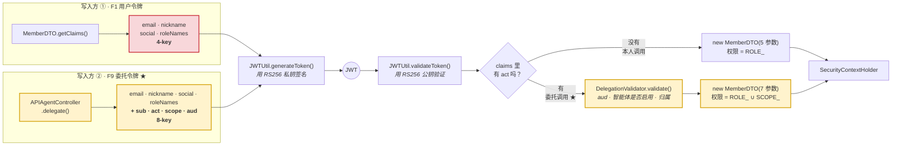
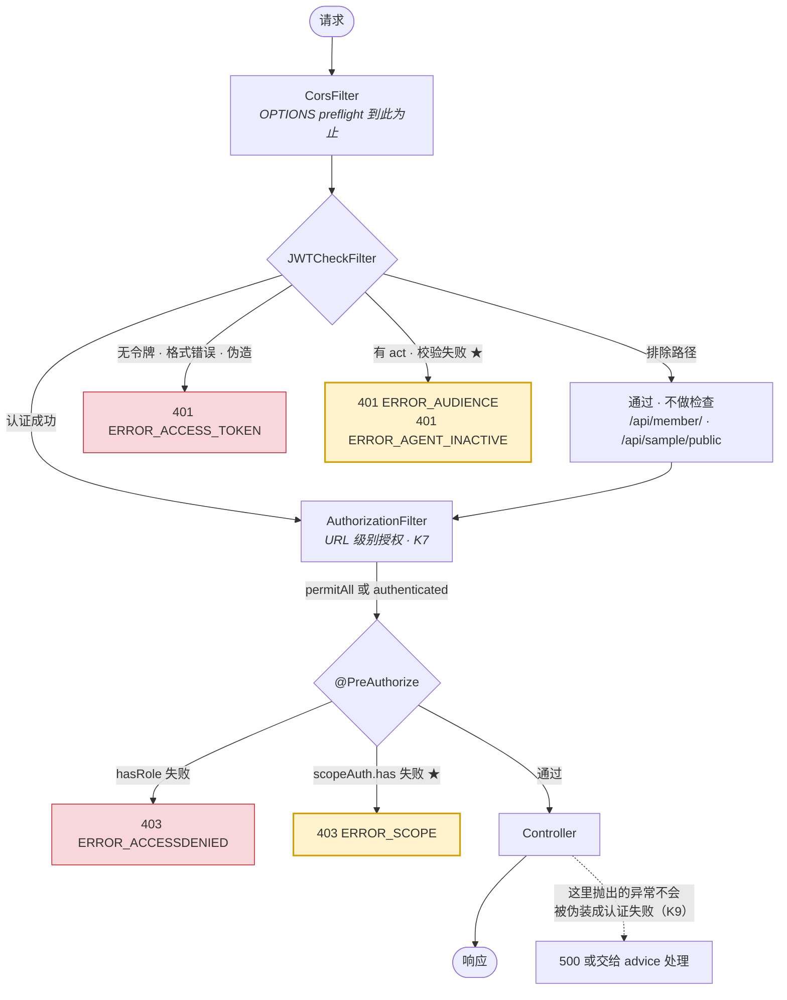

<br>

# agentic-auth

[한국어](README.md) · [English](README.en.md) · **中文**

> **当有谁代替我调用 API 时，这个请求应该以谁的身份发出？**
>
> 无论是集成服务、自动化工具还是 AI 智能体，面对的都是同一个问题。
> 变化在于 **AI 智能体让它变得迫在眉睫** —— 你无法预先知道它会调用什么，
> 而用户交出去的**不是访问权限，而是判断本身。**
>
> 本仓库就是为回答这一个问题而建的。
> 把答案写成代码，**让你在浏览器里点一点就看见它在哪里崩**，
> 并**用智能体的工具权限与提示词强制约束修改这些代码的流程**。

---

## ● 为什么做这个

"AI 智能体"这个词如今指的是两件完全不同的事。本仓库**两者都涉及**，
混在一起读会什么都理解不了，所以先把它们分开。

### 1. 开发期智能体 —— 写代码的 AI

定义在 `.claude/agents/` 中的 Claude Code 子智能体。
这是一条流水线，让认证代码只能按**规范 → 设计 → 任务顺序 → 实现**四个阶段修改，
它不会进入交付物。`build.gradle` 中没有任何 AI 依赖。

### 2. 运行期智能体 —— 跑在已交付产品里的 AI

用户实际使用的服务中内嵌的 AI：聊天机器人、代替用户调用 API 的 AI、
挂在 MCP 服务器上的智能体。**它是交付物的一部分，因此需要自己的身份认证。**
这正是"如何给 AI 智能体签发 JWT/OAuth"眼下成为热门话题的原因。

> **本仓库的目标是第 2 项。** 第 1 项是造出第 2 项的方法。
>
> 我们做的是运行期智能体的认证（`F9~F13`），而且**只通过开发期智能体流水线（第 1 项）**来实现。
> 本仓库里的委托认证代码，每一行都走过了那四个阶段。

### 那个"运行期智能体"是谁 —— 它不在本仓库里

**本仓库不制造 AI。它制造的是 AI 可以接入的位置，以及那个位置的认证。**

|                     | 是智能体吗 | 实际上是什么                                                    |
| ------------------- | ---------- | --------------------------------------------------------------- |
| `.claude/agents/`   | ✅         | 会判断、会用工具、会产出结果 —— **开发期**                      |
| **Claude · Cursor** | ✅         | 通过 MCP 接入并自行选择工具 —— **运行期。这正是 F9~F13 所认证的对象** |
| `mcp-server/`       | ❌         | **工具表面**。没有自主性，只暴露四个函数                        |
| `agent-example/`    | ❌         | 按固定顺序走一遍的**脚本**                                      |
| `domain/Agent.java` | ❌         | **委托登记记录**，更接近 OAuth 的 client registration           |

所以名字叫 `agentic-auth` —— 它是 **"auth for agents"**，而不是"一个 agent"。

### 为什么引入 MCP

智能体位于本仓库之外，这是设计使然。于是剩下的问题是 **那个 AI 要如何接入。**
MCP 就是那条通道 —— 它是 Claude、Cursor 这类 AI 客户端接入外部工具的标准规格。

在此之前，**没有任何 AI 真正使用过这套认证。** 委托令牌拦下什么、放行什么，
在前端页面上可以确认，但那是**机制层面的证明**；
**AI 是否真的在这些约束之内行动**，则无从验证。

有了 MCP 服务器，**Claude 就成了真正的行为者** —— 它自己挑选工具，
被拒绝时会读懂原因并向用户解释。

```
用户 ──[密码]──> mint-token ──[委托令牌]──> MCP 服务器 ──> API
                                                  ↑
                                        AI 只知道从这里开始的部分
```

MCP 服务器**既不知道用户密码，也不知道用户令牌**，它只持有一个委托令牌。
因此它出不了 `scope` 的范围；用户一旦撤回，**下一次调用就被拦下，无需重启。**
这两点都通过接入真实 MCP 客户端验证过 → [`mcp-server/`](mcp-server/README.md)

---

## ● 与 `security-jwt-agents` 有何不同

本仓库从 [`security-jwt-agents`](https://github.com/excelh11/security-jwt-agents) 分叉而来。
那个仓库的目的是**"亲眼看清 Spring Security + JWT 在哪里拦下请求"**，
四阶段流水线只是安全地修改那些代码的手段。

**这里目标变了。** 用户认证（`F1~F8`）如今是**地基**，
在其之上构建**运行期智能体的委托认证（`F9~F13`）**才是正题。

|                | security-jwt-agents        | **agentic-auth**                                     |
| -------------- | -------------------------- | ---------------------------------------------------- |
| 目的           | 用眼睛验证用户认证         | **构建智能体委托认证**                               |
| 功能规范       | `F1~F8`                    | `F1~F8`（地基）+ **`F9~F13`**                        |
| JWT 签名       | HS256 对称密钥（硬编码）   | **RS256 非对称** —— 能验证的一方无法伪造             |
| 令牌在说什么   | "我是 user1"               | "**以 user1 的权限，由 scheduler-bot** 发起的请求"   |
| 权限粒度       | 角色（`ROLE_USER`）        | 角色 **+ 动作级 scope**（`sample:read`）             |
| 撤回           | 不可能（没有令牌吊销）     | **只撤回某个智能体** —— 用户不会被登出               |
| 审计           | 零散的日志                 | **委托者 + 行为者成对记录**                          |
| 已知缺陷       | `K1~K9` 中 **K4·K7 未解决** | **`K1~K9` 全部解决**（K6 认定为误记并更正）            |
| 测试           | 20 个                      | **54 个**                                            |

---

## ● 问题出在哪

`user1` 登录时，现在签发的仍然是这样的令牌。

```json
{ "email": "user1@aaa.com", "roleNames": ["USER"], "exp": 1786… }
```

这个令牌只说明一件事 —— **"我是 user1。"**
浏览器前坐着一个人，所以这就够了。

**可是当你对 AI 说"看下我的日程，不冲突就把会订了"，这个前提就崩了。**
智能体要代替你调用 `GET /api/schedule`、`POST /api/meeting`，而并没有人按下按钮。
这个请求该以谁的身份发出？

最省事的答案是**把 user1 的令牌原样交出去**。能跑。代价是四件事同时崩塌。

| #   | 崩掉的东西       | 为什么                                                                                  |
| --- | ---------------- | --------------------------------------------------------------------------------------- |
| 1   | **无法区分行为者** | 日志里全是 `user1@aaa.com`。令牌里没有任何信息说明是人做的还是机器人做的               |
| 2   | **过度委托**     | 你说的是"只看日程"，但那个令牌能做 `ROLE_USER` 能做的**全部** —— 支付、注销账号也一样   |
| 3   | **无法单独撤回** | 要切断智能体就得作废 user1 的令牌，而那会**把用户本人也一起登出**                       |
| 4   | **泄露半径过大** | 外部智能体服务上留着一个**全权限、24 小时有效**的令牌                                   |

## ● 怎么解决

想想**代客泊车钥匙**。把车交给酒店时你不会连主钥匙一起给。
代客钥匙能开门、能打火，但打不开后备箱。而且因为它是**另一把钥匙**，
日后后备箱若被打开，"代客钥匙做不到这件事"是可以被证明的。

委托令牌长这样：

```json
{
  "sub": "user1@aaa.com",        // 为谁做？      ← 权限的来源     F9
  "act": "agent-a46e2155-…",     // 谁在实际执行？ ← 行为者        F9
  "scope": ["sample:read"],      // 能做到哪一步？                 F10
  "aud": "agentic-auth-server",  // 在哪里有效？                   F11
  "exp": 1786068519              // 10 分钟
}
```

关键在于 `sub`（委托者）与 `act`（行为者）被**分开**了。
用户本人的登录令牌里**这四项一个都没有** —— 它们存在本身，就意味着"这是一次被委托的调用"。

|                       | 做什么                                                    | 挡住哪个问题 |
| --------------------- | --------------------------------------------------------- | ------------ |
| **F9** `act` 声明     | 把行为者与委托者分开记录 · 智能体登记/撤回                | 1、3         |
| **F10** scope         | 列举这个令牌能做的动作 · **不得超过委托者本人的权限**     | 2            |
| **F11** `aud`         | 只在指定的 API 服务器上有效                               | 4            |
| **F12** 非对称签名    | 私钥签发、公钥验证 —— **验证方无法伪造**                  | —            |
| **F13** 审计日志      | 把 `sub` + `act` 成对记录                                 | 1            |

> 标准早就有了。`act` 出自 **RFC 8693**（OAuth 2.0 Token Exchange），`sub`·`aud`·`exp` 出自 **RFC 7519**（JWT）。
> 这里没有发明任何东西，只是把那些标准落到了本项目的 `MemberDTO.getClaims()` ↔ `JWTCheckFilter` 这对搭配上。

### AI 智能体与传统集成有何不同

上面这套机制**与 AI 无关也照样成立** —— 用在集成服务或自动化工具上同样适用。
那么，为什么是 AI 智能体让这个课题变得迫切？

|              | 传统集成（OAuth 应用） | AI 智能体                                  |
| ------------ | ---------------------- | ------------------------------------------ |
| 会调用哪些 API | **事先声明**           | **在运行时自行决定**                       |
| 交出去的是什么 | 访问权限               | **判断** —— 连"做什么"也一并交出           |
| 被操纵的风险 | 代码不会变             | **会被读到的内容牵着走**（提示注入）       |
| 数量 · 寿命  | 少量 · 长期            | 大量 · 短期                                |

**"无法预先知道它会调用什么"**才是关键。如果能知道，就不需要委托 ——
给一个专用账号配上固定权限即可。正因为不能知道，才必须把范围收窄、并且随时可以撤回。

> 反过来说，如果自动化的步骤本就是固定的，这里的委托机制**可能是过度设计**。
> 像 `agent-example/agent.mjs` 这样的固定脚本，一个服务账号就够了。

### 于是好在哪里

- **出事时半径很小。** 委托令牌即使泄露，能做的也只有 `sample:read`，只有 10 分钟，只在指定服务器上。
- **责任可追溯。** "这笔支付是本人做的，还是哪个智能体做的"从此有了答案。
- **可以只切断某一个智能体。** 封掉一个乱来的机器人，用户依然处于登录状态。
- **控制权回到用户手里。** 可以做出"只允许这个智能体读取"这样的授权界面。此前只有全给或全不给。

|            |                                                                |
| ---------- | -------------------------------------------------------------- |
| **前端**   | React 19 · TypeScript · Vite 8                                 |
| **后端**   | Java 21 · Spring Boot 3.5.15 · Spring Security 6 · jjwt 0.11.5 |
| **数据**   | Spring Data JPA · MariaDB                                      |
| **智能体** | 4 个 Claude Code 子智能体 + 一个斜杠命令                       |

> 做完 F9~F13，**gradle 依赖一个都没有增加。** jjwt 0.11.5 本身就支持 RS256。

---

## ● Result Image

从登录、签发委托令牌、越权触发 scope 违规，一直到撤回智能体，全部各对应一个按钮。
每次请求的 **HTTP 状态码与响应体原文**都会原样堆叠在日志区。


### F1~F8 · 用户认证（地基）

| #   | 操作                             | 预期结果                                                 |
| --- | -------------------------------- | -------------------------------------------------------- |
| 1   | 登录                             | 200 · 签发 accessToken 与 refreshToken，显示载荷与剩余时间 |
| 2   | 用错误密码登录                   | **401** `ERROR_LOGIN`                                    |
| 3   | 调用受保护 API（带令牌）         | 200                                                      |
| 4   | 调用受保护 API（无令牌）         | **401** `ERROR_ACCESS_TOKEN`                             |
| 5   | 用伪造令牌调用                   | **401** `ERROR_ACCESS_TOKEN`                             |
| 6   | 调用 ADMIN 专用 API              | USER 账号会得到 **403** `ERROR_ACCESSDENIED`             |
| 7   | 调用 refresh（令牌仍有效）       | 原样返回同一对令牌                                       |
| 8   | 强制 accessToken 过期 → 调用 API | **401** `ERROR_ACCESS_TOKEN`                             |
| 9   | 接着调用 refresh                 | 签发新的 accessToken                                     |
| 10  | 不带 refreshToken 调用 refresh   | **400**（参数缺失）※                                     |

### F9~F13 · 智能体委托认证

| #   | 操作                                   | 预期结果                                                  |
| --- | -------------------------------------- | --------------------------------------------------------- |
| 1   | 登记智能体                             | 签发 `agentId`                                            |
| 2   | 签发委托令牌（仅 `sample:read`）       | 带有 `sub`·`act`·`scope`·`aud` 的令牌                    |
| 3   | 查看委托令牌的载荷                     | 看到用户令牌里没有的那四项声明                            |
| 4   | scope 之内的 API（`/api/sample/user`） | **200**                                                   |
| 5   | scope 之外的 API（`/api/sample/list`） | **403** `ERROR_SCOPE`                                     |
| 6   | 篡改 audience 后调用                   | **401** `ERROR_ACCESS_TOKEN` ※※                           |
| 7   | 尝试委托超出自身权限的范围             | `ERROR_SCOPE_EXCEEDS_ROLE`                                |
| 8   | 用委托令牌尝试再次委托                 | 拒绝 `ERROR_SCOPE`                                        |
| 9   | 撤回智能体（停用）                     | 200 · **用户本人的令牌依然有效**                          |
| 10  | 撤回后再用委托令牌调用                 | **401** `ERROR_AGENT_INACTIVE` —— 尚未过期也照样被拦下    |

> **请对比第 4 项与第 5 项。** 同一个委托令牌，一个通过，一个被拦。
> **而用用户本人的令牌，两者都是 200。** scope 是只加在委托上的额外约束，
> 并不替代用户的角色权限体系。
>
> **做完第 9 项后，看页面上方的"当前令牌状态"。** 只切断了智能体，用户安然无恙。
> 这就是问题 3（无法单独撤回）被解决后的样子。
>
> **为什么 F2（无状态）没有按钮** —— 它描述的是服务器**不**创建会话这一性质，
> 没有可以点击的对象。整个页面本身就是 F2 的证据：不用 cookie、不用 session，
> 所有调用都只靠 `localStorage` 里的令牌完成。

> ※ `docs/1-SPEC.md` 的 F5 写明这种情况会返回 `NULL_REFRASH`，实际是 400。
> `@RequestParam` 默认必填，Spring 在进入方法之前就拦下了。控制器内部的 `null` 检查是**不可达代码**。
>
> ※※ 第 6 项为什么**不是** `ERROR_AUDIENCE` —— 浏览器没有签名私钥，改动 `aud` 会让签名失效。
> 服务器**先**验签名、后验 audience，所以先返回的是 `ERROR_ACCESS_TOKEN`。
> **这不是缺陷，而是 F12（非对称签名）确实在起作用的证据。**

前端依据**响应体中的 `error` 字符串**而非状态码来分支。因为同一个 401 里会同时出现
`ERROR_LOGIN` · `ERROR_ACCESS_TOKEN` · `ERROR_AGENT_INACTIVE` · `ERROR_AUDIENCE`。

---

## ● 目录结构

```
agentic-auth/         # ← 仓库根目录 · 在此启动 Claude Code
├── .claude/agents/   # 四阶段流水线的智能体
├── .claude/commands/ # /agentic 斜杠命令
├── SKILL.md          # 把本项目当作技能复用的定义
├── docs/             # 智能体据以判断的基准文档
├── server/           # 后端 —— Spring Boot (:8080)，Gradle 项目根目录
│   ├── keys/         #   RS256 密钥对（F12）—— 已被 gitignore，缺失时自动生成
│   └── src/main/java/com/agenticauth/
├── front/            # 前端 —— Vite + React + TS (:5173)，仅用于验证
├── agent-example/    # 使用委托令牌的智能体脚本（Node，零依赖）
└── mcp-server/       # MCP 服务器 —— Claude · Cursor 直接调用本 API
```

前端与后端是**有意分开的**。只有源（origin）不同，CORS 与 preflight 才会真正发生，
也才能确认认证是否真的生效。这正是不使用 Vite proxy 的原因。

---

## ● 运行方式

需要两个终端，并且 MariaDB 必须已经启动。

```bash
# 0) 准备数据库（仅一次）—— 在 MariaDB 中执行 server/db/schema.sql
#    会创建 agenticauthdb 数据库与 aauthuser 账号

# 1) 创建测试账号（仅一次）
cd server
./gradlew.bat test --tests "com.agenticauth.repository.MemberRepositoryTests"

# 2) 后端 —— http://localhost:8080
./gradlew.bat bootRun

# 3) 前端（另一个终端，在仓库根目录）—— http://localhost:5173
cd front
npm install
npm run dev
```

测试账号 `user1@aaa.com` / `1111` —— 数据库中**必须以 BCrypt 哈希形式保存**。存明文的话永远只会得到 `ERROR_LOGIN`。

```bash
cd server
./gradlew.bat test        # 54 个
```

### 从智能体的视角来看

前端页面是由人点按钮来确认**委托机制**本身的地方。
**只持有委托令牌去调用 API 的客户端那一侧**是另外一个东西。

```bash
cd agent-example
node agent.mjs            # 零依赖 —— 使用 Node 18+ 内置 fetch
```

它会把 `[用户]` 与 `[智能体]` 分开输出，于是你能在终端里直接看到：
**同一个 API，智能体被拦下而用户通过**；以及
**只切断智能体，用户并不会被登出**。
一旦有任何结果与预期不符就以退出码 1 结束，可以直接接进 CI。
详见 [`agent-example/README.md`](agent-example/README.md)。

### 接上真正的 AI —— MCP 服务器

如果说脚本证明了流程，那么 [`mcp-server/`](mcp-server/README.md) **让真正的 AI 成为行为者**。
接上 Claude Code、Claude Desktop 或 Cursor，那个 AI 就会代替用户调用本 API。

```bash
cd mcp-server
npm install
node mint-token.mjs --scope sample:read    # 用户完成委托 → 输出可直接粘贴的配置
node test-client.mjs                       # 用真实 MCP 客户端接入验证
```

```
用户 ──[密码]──> mint-token.mjs ──[委托令牌]──> MCP 服务器 ──> API
                                                     ↑
                                           AI 只知道从这里开始的部分
```

如果你没有委托 `sample:list`，却对 AI 说*"把列表取来"*，
**AI 会被拒绝，并把这件事解释给用户听**。而当用户撤回后，
**不必重启 MCP 服务器，下一次调用就会立刻被拦下。**

> **不要删除 `server/keys/`。** 里面是 RS256 密钥对；一旦缺失就会重新生成，
> **在那之前签发的所有令牌都会失效**。它已被 gitignore，克隆后首次启动时会自动创建。

---

## ● Agents

认证代码只要改错一处就会悄悄出问题，因为其中存在**编译器无法校验的耦合** ——
比如写入 `claims` 的一侧与读取 `claims` 的一侧。
因此这里不直接改代码，而是走四个阶段。

```
SPEC  ──→  PLAN  ──→  TASKS  ──→  IMPLEMENT
做什么？     怎么做？     按什么顺序？    落到代码
```

### 各阶段的智能体

| 阶段          | 智能体          | 工具权限                              | 可写入的位置              | 产出                       |
| ------------- | --------------- | ------------------------------------- | ------------------------- | -------------------------- |
| 1 · SPEC      | `agentic-spec`  | `Read` `Write` `Edit` `Glob` `Grep`   | **仅 `docs/1-SPEC.md`**   | 需求规范、契约影响分析     |
| 2 · PLAN      | `agentic-plan`  | `Read` `Glob` `Grep` `Bash`（查询）   | **无 —— 只读**            | 技术选型、设计决策、风险点 |
| 3 · TASKS     | `agentic-tasks` | `Read` `Write` `Edit` `Glob` `Grep`   | **仅 `docs/`**            | 按依赖顺序拆分的任务清单   |
| 4 · IMPLEMENT | `agentic-impl`  | + `Bash`                              | **全部**                  | 代码 + 测试 + 验证结果     |

### 什么被强制，什么没有

`.claude/agents/agentic-spec.md` **不是智能体，而是定义（definition）**。
它由 `---` 包裹的六行前置元数据，加上其下的系统提示词构成。

```yaml
---
name: agentic-spec
description: "…"                       # 何时调用这个智能体
tools: Read, Write, Edit, Glob, Grep    # ★ 唯一由 harness 真正强制的一行
model: sonnet
---
```

**不在 `tools:` 里的工具，提示词再怎么要求也用不了。** 这就是这一行的特殊之处。
其余全都是提示词 —— 期待被遵守，而非在结构上被堵死。

|                                                     | 靠什么挡住                              | 能绕开吗                 |
| --------------------------------------------------- | --------------------------------------- | ------------------------ |
| `agentic-plan` 无法修改文件                          | **`tools:` 里没有 `Write`·`Edit`**       | ❌ 不可能                |
| `agentic-spec`·`agentic-tasks` 不碰**代码**          | 提示词指令                              | ⚠️ 可能 —— 依赖自觉      |
| `agentic-plan` 的 `Bash` 仅用于查询                  | 提示词指令                              | ⚠️ 可能                  |

> **最初第 1～3 阶段都没有写入工具。** 但实际跑下来发现，SPEC 与 TASKS
> **连自己产出的 `docs/` 文档都写不了**，每次都得由人转录一遍。
> 于是只给了这两个 `Write`·`Edit`，**范围限制则降级为提示词约束**。
> **强制力确实因此减弱了** —— 但 `agentic-plan` 依然是只读的，
> 所以"设计阶段碰不了文件"这一性质在其中一个阶段仍然成立。

### 这条流水线实际拦下了什么

F9~F13 全部走过这四个阶段，而且**设计阶段确实先于代码找出了真正的漏洞**。

- **PLAN 阶段** —— `/api/member/` 系列是 `JWTCheckFilter` 的排除路径，
  因此被撤回的智能体可能**通过 refresh 复活**。这是在写代码之前发现的，
  通过在 `APIRefreshController` 中单独加校验堵住，并把证明它的测试单列为一项任务。
- **PLAN 阶段** —— 把 `Filter` 类型暴露为 Spring Bean 会让 servlet 容器**重复注册**，
  导致每个请求执行两次（审计日志也会记两遍）。改为用 `new` 组装而非提升为 Bean。
- **TASKS 阶段** —— 标明 `MemberDTO` · `JWTCheckFilter` · `CustomSecurityConfig` 与测试
  是**拆开就连编译都过不了的一个整体**，从而不允许中途停下。
- **IMPLEMENT 阶段** —— 在首次给 `SampleController` 加上 `@PreAuthorize` 的紧后面设了一道关卡：
  **"普通用户令牌是否仍然返回 200"**，不通过就不许继续。

### 为什么这样做

这并不是新发明的流程。**先写设计文档、达成一致，然后再写代码**本就是由来已久的标准做法；
这里所做的，只是把每个阶段从依靠人的自律，改为依靠**智能体的工具权限与提示词**来强制执行。
（哪些由工具挡住、哪些只是提示词，见上文[什么被强制，什么没有](#什么被强制什么没有)）
在 LLM 编码工具领域，同样的方向正以 _spec-driven development_ 之名逐渐确立 ——
AWS Kiro、GitHub Spec Kit 等都在解决同一个问题。

这套做法对认证代码格外划算，原因有两点：

- **存在编译器抓不到的耦合。** 写入 `claims` 的一侧（`MemberDTO.getClaims()`）与读取的一侧
  （`JWTCheckFilter`）仅靠字符串键相连，只改一边的话构建照样通过，却会在运行时炸掉。
- **错误字符串本身就是 API 契约。** 只要改动一个 `ERROR_ACCESS_TOKEN`，前端的分支就会悄然失效。
  SPEC 阶段会先判定契约影响，一旦有会被破坏的项目就在那里停下。

### 使用方法

```
/agentic 让用户可以自行指定委托令牌的过期时间
/agentic 想按智能体添加调用次数限制
```

每完成一个阶段就展示结果，**得到批准后**才进入下一步。绝不会把四个阶段一口气跑完。
也可以直接单独调用某一阶段 —— *"用 agentic-spec 智能体先把需求梳理出来"*。

### 智能体遵守的规则

- **不做猜测。** 必须读取真实文件，并以 `文件:行号` 为依据描述当前行为。
- **错误字符串与响应字段名是与前端的契约。** 修改须经用户批准，新增则自由。
- **已知缺陷只能提出建议。** 未经批准不得修复，也不得擅自扩大范围。
- **不掩盖失败。** 测试挂了就原样贴出输出。若因没有数据库而无法运行 `@SpringBootTest`，就不能说"通过了"。

### 基准文档

智能体只依据这些文档作判断。**规范变了，先改文档再改代码。**

| 文档                                 | 内容                                                    |
| ------------------------------------ | ------------------------------------------------------- |
| [`docs/0-RULES.md`](docs/0-RULES.md) | **工作规则** —— 本仓库真实发生过的事故，附带依据        |
| [`docs/1-SPEC.md`](docs/1-SPEC.md)   | 功能规范 `F1~F13`、错误码契约、已知缺陷 `K1~K9`         |
| [`docs/2-PLAN.md`](docs/2-PLAN.md)   | 可用技术、禁用 API、请求处理流程                        |
| [`docs/3-TEST.md`](docs/3-TEST.md)   | 测试代码模板、39 项回归检查清单                         |

### 迁移到其他项目

这些智能体**不适合在空文件夹里从零生成项目**，因为 `agentic-spec` 的前提是
*"不做猜测；必须读取真实文件、确认当前行为后再描述"*。
正确的做法是**以本仓库为起点** —— 代码、规范、规则会作为一整套跟着走 —— 再在此基础上生长。

**1. 取得仓库**

```bash
git clone https://github.com/excelh11/agentic-auth.git my-auth
cd my-auth
```

**2. 修改包名** —— 把 `com.agenticauth` 改成你想要的名字。三处必须一起改。

```
server/src/main/java/com/agenticauth/     目录名
server/src/test/java/com/agenticauth/     目录名
*.java 中的 package · import 声明
docs/*.md · CLAUDE.md 中的路径表述
```

**3. 填写数据库配置**

```bash
cd server/src/main/resources
cp application.properties.example application.properties   # 填入具体值
```

**4. 先从 `docs/1-SPEC.md` 改起。** 规范先于代码。
删掉不需要的功能，把新需要的东西写成需求。智能体正是依据这份文档作判断。

**5. 用 `/agentic` 添加功能**

```
/agentic 让社交登录签发的令牌也走同一个过滤器
```

> ⚠️ **智能体定义位于仓库根目录的 `.claude/`。** 必须在**仓库根目录**启动 Claude Code，
> `/agentic` 与子智能体才会被识别；在 `server/` 目录下启动则不会生效。

---

## ● Class diagrams

全部五张图都在 **[`docs/diagrams/class-diagrams.md`](docs/diagrams/class-diagrams.md)**。
这里只放理解本项目所必需的两张。

> 它们原本是 PNG，但类一变就得重画，于是改成了 **Mermaid 文本**。
> 现在改代码时，图的变化也会出现在 diff 里。

### 写入 claims 的一侧与读取的一侧 —— 最危险的地方

`MemberDTO` 把自己的字段摊平成 `Map` 装进令牌，
`JWTCheckFilter` 再从那个 `Map` 里逐个取键重新组装。
**两者仅靠字符串相连，只改一边的话编译照样通过，运行时才炸。**

在 F9~F13 中**写入的一侧分成了两个**。读取的一侧仍是一个，靠 `act` 是否存在来分支。



> **两个红框是一对。** 在这里加键或改名，`JWTCheckFilter` 中读取的部分
> **必须**同步修改。编译器什么都不会告诉你。

### 一个请求经过的路径

在哪一道关卡、以哪个错误码被拦下。**F9~F13 新增的关卡是黄色的。**



> **陷阱就在于 `/api/member/` 系列是过滤器的排除路径。**
> `APIRefreshController` 不经过 `JWTCheckFilter`，因此**必须自己校验委托**。
> 否则被撤回的智能体会通过 refresh 复活。

---

## ● 后端代码的已知缺陷

缺陷不藏着 —— 全部以 `K1~K9` 记录在 `docs/1-SPEC.md` 里。智能体
**未经批准不得修复这些项目**；目的就是把"明知存在却有意保留"这件事留下记录。

**目前没有未解决项。** 全部通过这条流水线修复。

| #      | 曾经是什么                                                                          | 做了什么                                                                              |
| ------ | ----------------------------------------------------------------------------------- | -------------------------------------------------------------------------------------- |
| **K1** | 请求头为 `null` 时 `substring(7)` 抛 NPE → 被 catch 吞掉，导致原因被掩盖            | 在解析前先检查 `Bearer ` 前缀，并用 `log.warn` 记下原因                                 |
| **K2** | 认证失败没有 `setStatus()`，以 HTTP 200 返回                                         | `JWTCheckFilter` · `APILoginFailHandler` 一律 **401**                                   |
| **K3** | `ResponseEntity.ok()` —— JWT 异常也返回 200                                          | 改为 `ResponseEntity.status(UNAUTHORIZED)` —— **401**                                   |
| **K4** | JWT 签名密钥是硬编码的**对称密钥** —— 能验证的一方也能伪造                           | **由 F12 解决。** 改用 RS256 密钥对，从 `server/keys/` 读取，缺失则生成                 |
| **K5** | `pw`（BCrypt 哈希）混进了 JWT claims，可直接从载荷读出                               | 从 claims 中移除 · credentials 置 `null` —— 这伴随着 **F1 响应契约的变更**              |
| **K7** | 未设置 `authorizeHttpRequests` —— 保护完全依赖 `@PreAuthorize`                       | 补上 URL 级别授权，作为**兜底防线**，避免漏加注解的端点变成不设防                        |
| **K8** | 只把 `"Expired"` 当作过期，于是**把损坏的令牌连同 200 一起原样退回**                 | 所有校验失败都视为需要重新签发。重新签发只在 `refreshToken` 通过校验之后进行            |
| **K9** | `filterChain.doFilter()` 位于 `try` 之内，导致**连控制器与数据库异常也变成 401**     | 把链式调用移出 `try`。认证到此为止，之后的异常不再插手                                  |

> **K8 的修法与 security-jwt-agents 不同** —— 那边对「非过期原因导致无效」的令牌**直接返回 401 拒绝**。
> 这里则采用 OAuth2 `refresh_token` grant 的理解：`refreshToken` 本身才是凭证，
> 因此这类令牌一律**视为需要重新签发**，accessToken 只是「是否需要换新」的提示。
> 两者都堵住了 K8 的实质问题 —— 把损坏的令牌连同 200 一起退回。**哪一种都不是缺陷。**

**⚪ 已更正 —— K6**

> 原本记作"使用了 jjwt 0.11.5 的废弃 API"，**但它并不是缺陷。**
> 打开 `-Xlint:deprecation` 编译后，**废弃警告为 0 条**。
> `setClaims`·`parserBuilder`·`setExpiration` 在 0.11.5 中是**正式 API**，到 0.12.x 才被废弃 ——
> 也就是把**升级时才需要应对的事项**误记成了当前缺陷。
> 排查过程中暴露出的**一条真实警告**（unchecked cast）已一并清理，目前编译警告为 **0 条**。

K5 **改变了响应契约**，所以先修改了 `docs/1-SPEC.md` 的 F1，再一次性修改
`MemberDTO.getClaims()`（写入方）与 `JWTCheckFilter`（读取方），并同步修改前端的 `types.ts`。
为防止回归，还追加了**解码已签发令牌的载荷、断言其中不含哈希的测试**。

`application.properties` 中的数据库连接信息**仅用于本地开发**，不会提交到仓库。

---

## ● 许可证

[MIT](LICENSE)
