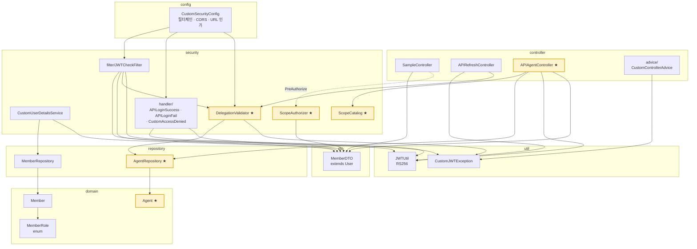
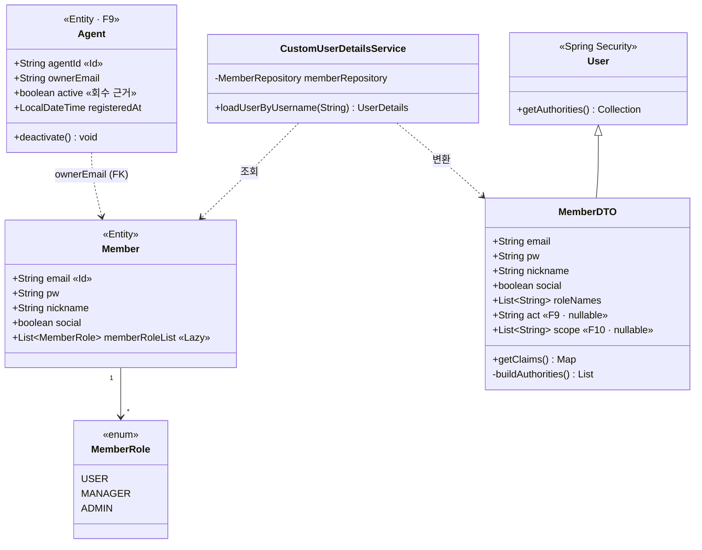
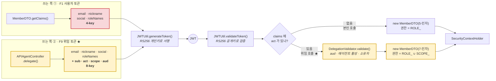
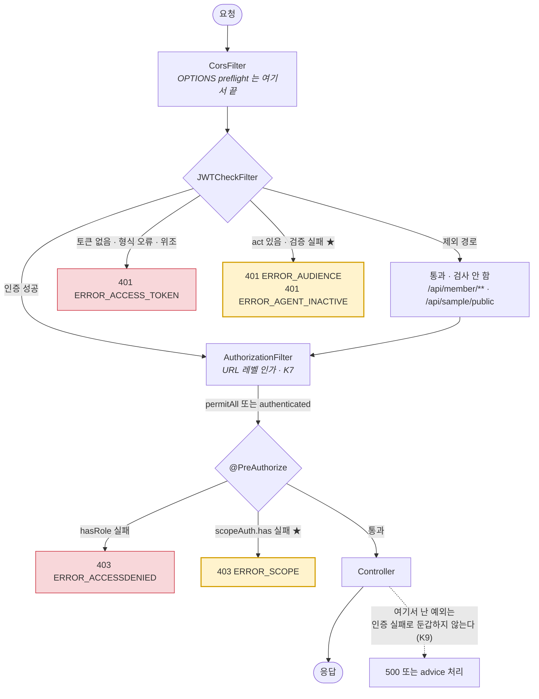
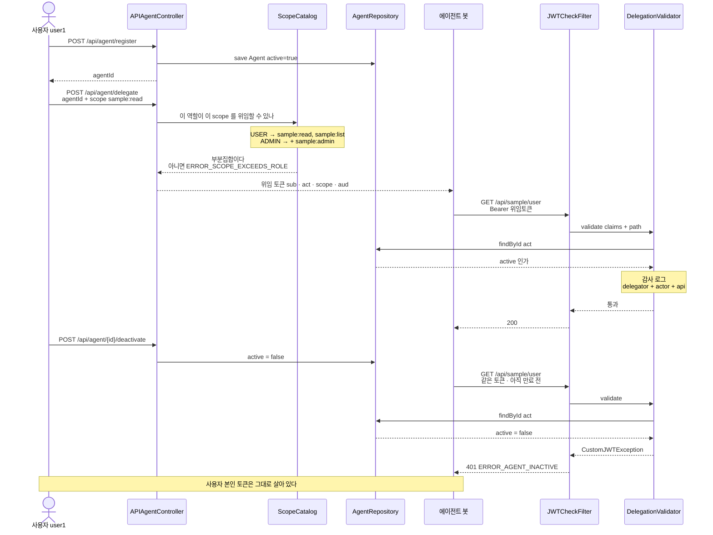

# 클래스 다이어그램

> **Mermaid 소스다.** GitHub·VS Code가 그대로 렌더링한다.
> 예전에는 PNG였는데, 클래스가 바뀔 때마다 다시 그려야 해서 **텍스트로 바꿨다.**
> 코드를 고쳤으면 여기도 같이 고친다 — `docs/1-SPEC.md` 와 같은 규칙이다.

전체 22개 클래스. `F9~F13`(에이전트 위임 인증)에서 새로 들어온 것은 **★ · 노란색**으로 표시했다.

---

## 1 · 패키지와 의존 방향

의존이 한 방향으로만 흐른다. `util` 은 아무것도 모르고, `domain`·`repository` 는 시큐리티를 모른다.

---

## 2 · 인증 주체를 나르는 클래스

DB의 `Member` 와 Spring Security가 이해하는 `MemberDTO` 는 필드가 거의 같지만 **다른 타입**이다.
둘을 잇는 유일한 지점이 `CustomUserDetailsService.loadUserByUsername()` 이다.

`Agent` 는 이 계보 바깥에 있다 — 인증 주체가 아니라 **행위자의 신원**이기 때문이다.

> `MemberDTO` 는 생성자가 **둘**이다.
> 5-인자는 사용자 본인 토큰(F1)용, **7-인자는 위임 토큰(F9)용**으로 `act`·`scope` 를 더 받는다.
> 권한은 `ROLE_(roleNames)` **∪** `SCOPE_(scope)` 의 합집합이 된다.
> `Agent.agentId` 는 `@Id`, `Member.email` 도 `@Id` 이며 `memberRoleList` 는 지연 로딩이다.

---

## 3 · claims 를 쓰는 쪽과 읽는 쪽

**여기가 이 프로젝트에서 가장 위험한 지점이다.**
쓰는 쪽과 읽는 쪽이 **문자열 키로만** 이어져 있어서, 한쪽만 고치면 컴파일은 통과하고 런타임에 터진다.

F9~F13에서 **쓰는 쪽이 둘로 갈렸다.** 읽는 쪽은 하나이며 `act` 의 유무로 분기한다.

> **빨간 박스 두 개가 짝이다.** 여기에 키를 더하거나 이름을 바꾸면
> `JWTCheckFilter` 의 읽는 부분도 **반드시 같이** 고쳐야 한다. 컴파일러는 아무것도 말해주지 않는다.

---

## 4 · 요청 하나가 지나가는 길

`JWTCheckFilter` 는 `UsernamePasswordAuthenticationFilter` **앞**에 선다.
`ExceptionTranslationFilter` 는 그보다 **뒤**에 있어서, `@PreAuthorize` 거부는 필터까지 올라오지 않는다.

> **`/api/member/**` 가 제외 경로**라는 게 함정이었다. `APIRefreshController` 는 필터를 안 거치므로
> **위임 검증을 스스로 해야 한다.** 안 그러면 회수한 에이전트가 refresh로 부활한다.

---

## 5 · F9~F13 위임 인증의 협력 관계

> **회수가 "발급 시점"이 아니라 "매 요청 시점"의 게이트**라는 게 핵심이다.
> 그래서 `DelegationValidator` 가 요청마다 DB를 한 번 조회한다 — PK 단건이다.
> 일반 사용자 토큰에는 이 비용이 없다. `act` 가 없으면 아예 호출하지 않는다.
